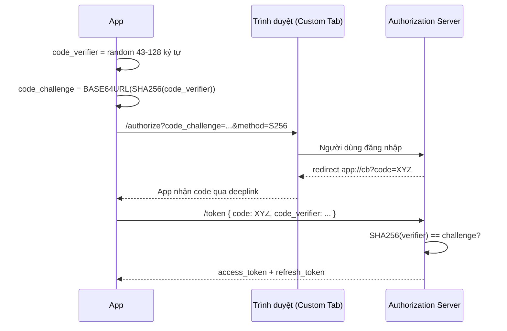
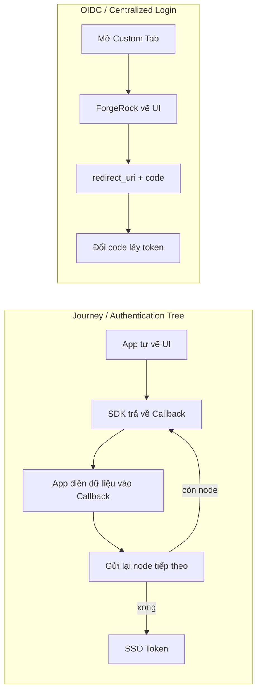
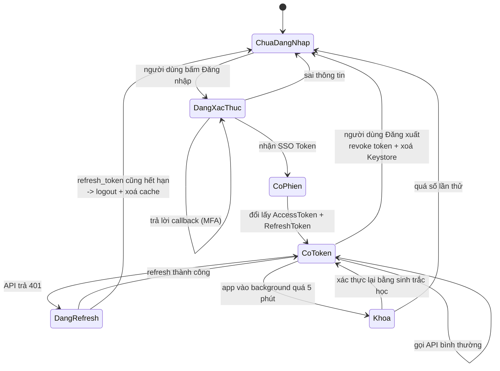
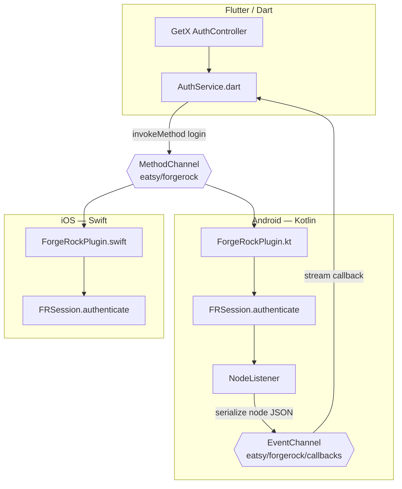

# 01 — IAM & ForgeRock: luồng xác thực doanh nghiệp

> Trang tham chiếu kỹ thuật thuần: [../07-tich-hop/forgerock.md](../07-tich-hop/forgerock.md).
> Trang này là **góc nhìn phỏng vấn**: thuật ngữ, sơ đồ luồng, và những chỗ hay bị vặn.

---

## 1. IAM · IAA · IGA — phân biệt cho đúng

Rất nhiều ứng viên nói "em làm IAM" rồi không phân biệt được ba khái niệm. Người phỏng vấn banking
hỏi câu này để lọc.

| | Viết tắt của | Trả lời câu hỏi | Ví dụ trong app ngân hàng |
|---|---|---|---|
| **IAM** | Identity & Access Management | *Bạn là ai, và bạn được vào đâu?* | Đăng nhập, SSO, cấp token, phân quyền theo role |
| **IAA** | Identification, Authentication, Authorization | *Ba bước con của IAM* | (1) Khai báo là ai — nhập username. (2) Chứng minh — password/OTP/vân tay. (3) Cho phép — token có scope `transfer` không |
| **IGA** | Identity Governance & Administration | *Ai đã cấp quyền đó, có được rà soát không?* | Quy trình duyệt quyền, thu hồi khi nghỉ việc, audit log |

> **Câu chốt để nói trong phỏng vấn:** *"Ở phía mobile em chạm vào IAA — nhận diện, xác thực,
> và tiêu thụ kết quả phân quyền dưới dạng scope/claim trong token. IGA là phần backend/vận hành,
> app chỉ là bên thụ hưởng."*

### 3 yếu tố xác thực (authentication factors)

| Loại | Tiếng Anh | Ví dụ |
|---|---|---|
| Cái bạn **biết** | Something you know | Mật khẩu, mã PIN |
| Cái bạn **có** | Something you have | Điện thoại (SMS OTP, Push), token cứng, passkey gắn thiết bị |
| Cái bạn **là** | Something you are | Vân tay, khuôn mặt |

**MFA = kết hợp ≥ 2 loại KHÁC NHAU.** Password + PIN **không phải** MFA (cùng nhóm "biết").
Đây là bẫy hay hỏi.

---

## 2. OAuth 2.0 vs OIDC — đừng lẫn

| | **OAuth 2.0** | **OpenID Connect (OIDC)** |
|---|---|---|
| Giải quyết | **Uỷ quyền** (authorization) | **Xác thực** (authentication) |
| Câu hỏi | "App này được phép làm gì thay tôi?" | "Người đang đăng nhập là ai?" |
| Sản phẩm | `access_token` (opaque hoặc JWT) | thêm `id_token` (**luôn** là JWT) |
| Ví dụ | Cho app đọc danh sách tài khoản | Biết tên/email/sub của khách hàng |

OIDC là **lớp mỏng nằm trên** OAuth2. ForgeRock nói "OIDC" là nói đến cả hai.

### Các loại token

| Token | Sống bao lâu | Cất ở đâu | Dùng làm gì |
|---|---|---|---|
| `access_token` | 5–15 phút | **RAM** (biến trong memory) | Gắn header `Authorization: Bearer` |
| `refresh_token` | vài giờ → vài ngày | `EncryptedSharedPreferences` / Keystore | Xin access token mới, **không** gửi cho API nghiệp vụ |
| `id_token` | ngắn | RAM | Đọc thông tin user (`sub`, `name`), **không** dùng gọi API |
| **SSO Token** (ForgeRock) | theo session AM | Cookie do SDK quản lý | Chứng minh phiên với AM, đổi lấy OAuth token |

### Vì sao bắt buộc PKCE trên mobile

Authorization Code flow gốc dùng `client_secret`. **App mobile không giữ được secret** — ai cũng
decompile APK ra được. PKCE (RFC 7636) thay secret bằng cặp dùng-một-lần:



**Tại sao an toàn:** app độc hại có cướp được `code` qua deeplink cũng vô dụng, vì nó không có
`code_verifier` — thứ chưa bao giờ rời khỏi app.

> ⚠️ Phải dùng **Custom Tabs**, không được dùng `WebView`. RFC 8252 cấm WebView vì app cha đọc
> được mọi thứ người dùng gõ, và WebView không chia sẻ được cookie SSO của hệ thống.

---

## 3. ForgeRock: hai kiểu tích hợp



| | Journey | OIDC |
|---|---|---|
| Ai vẽ UI | **App** | ForgeRock |
| Giữ được thương hiệu ngân hàng | ✅ | ❌ (chỉ tuỳ biến trên server) |
| MFA xử lý ở đâu | Trong app, từng callback | Trong trình duyệt |
| SSO với app khác cùng ngân hàng | Khó | ✅ Dễ |
| Đúng chuẩn RFC 8252 | — | ✅ |

**Ngân hàng gần như luôn chọn Journey** cho luồng chính, vì bộ phận marketing không chấp nhận
màn hình đăng nhập trông như trang web lạ.

### Journey / Tree / Node / Callback

- **Journey (Tree)** — cây luồng xác thực cấu hình trên AM, ví dụ `LoginWithMFA`.
- **Node** — một bước trong cây: kiểm tra username, kiểm tra password, gửi OTP, đánh giá rủi ro.
- **Callback** — cách server hỏi app một câu. App **không** biết trước cây có bao nhiêu bước;
  nó cứ nhận callback, điền, gửi lại, đến khi nhận được token.

Đây là điểm đẹp nhất của mô hình này để nói trong phỏng vấn:

> *"Bên nghiệp vụ bật thêm bước xác thực rủi ro trên AM thì app **không cần build lại**. App chỉ
> cần biết render các loại callback nó hỗ trợ. Đó là lý do em phải viết một `CallbackRenderer`
> tổng quát chứ không hardcode màn hình OTP."*

Các callback hay gặp:

| Callback | Ý nghĩa | App phải làm gì |
|---|---|---|
| `NameCallback` | Hỏi username | Điền text |
| `PasswordCallback` | Hỏi password | Điền text, che input |
| `ChoiceCallback` | Chọn 1 trong N | Hiện danh sách (chọn kênh OTP) |
| `TextOutputCallback` | Server muốn hiển thị 1 thông báo | Show text, không có input |
| `ConfirmationCallback` | Nút bấm (OK/Cancel) | Render button |
| `DeviceProfileCallback` | Thu thập metadata thiết bị | SDK tự làm, cần xin quyền |
| `WebAuthnRegistrationCallback` | Đăng ký passkey | Gọi FIDO2 API → xem [trang 02](02-biometric-webauthn.md) |
| `WebAuthnAuthenticationCallback` | Đăng nhập bằng passkey | Ký challenge |
| `SuspendedTextOutputCallback` | Magic link qua email | App treo chờ deeplink |

### Code khung — Journey trên Android

```kotlin
// Khởi tạo một lần trong Application
FRAuth.start(applicationContext)

FRSession.authenticate(context, "LoginWithMFA", object : NodeListener<FRSession> {

    override fun onCallbackReceived(node: Node) {
        // KHÔNG hardcode thứ tự bước. Duyệt callback và render động.
        node.callbacks.forEach { callback ->
            when (callback) {
                is NameCallback     -> callback.setName(state.username)
                is PasswordCallback -> callback.setPassword(state.password.toCharArray())
                is ChoiceCallback   -> showChoiceDialog(callback)   // cần UI -> return sớm
                is TextOutputCallback -> showMessage(callback.message)
                else -> Unit
            }
        }
        node.next(context, this)   // gửi node hiện tại, chờ node kế tiếp
    }

    override fun onSuccess(result: FRSession?) {
        // Đã có SSO token. Đổi tiếp sang OAuth token nếu backend yêu cầu Bearer.
        exchangeForAccessToken()
    }

    override fun onException(e: Exception) {
        // AuthenticationException  -> sai thông tin đăng nhập
        // AuthenticationRequiredException -> phiên hết hạn, phải login lại
        handle(e)
    }
})
```

**Bẫy số 1 khi làm thật:** `onCallbackReceived` chạy trên background thread và **bắt buộc** kết thúc
bằng `node.next(...)`. Nếu callback cần người dùng nhập (OTP), bạn phải **giữ tham chiếu `node`**,
return khỏi hàm, và chỉ gọi `node.next()` sau khi người dùng bấm xác nhận. Quên điều này → luồng
treo im lặng, không lỗi, không log.

---

## 4. Vòng đời token — sơ đồ phải thuộc



**Trạng thái `Khoa` là thứ tách app banking khỏi app thường.** Người phỏng vấn rất thích nghe:

> *"App banking phải khoá màn hình khi vào background quá N giây, và che nội dung trong màn hình
> Recents bằng `FLAG_SECURE`. Em cài `ProcessLifecycleOwner` để đếm thời gian nền, kết hợp
> `WindowManager.LayoutParams.FLAG_SECURE` để chặn cả screenshot."*

```kotlin
// Chặn screenshot + che trong Recents — bắt buộc với màn có số dư/OTP
window.setFlags(
    WindowManager.LayoutParams.FLAG_SECURE,
    WindowManager.LayoutParams.FLAG_SECURE,
)

// Đếm thời gian ở background toàn app
ProcessLifecycleOwner.get().lifecycle.addObserver(object : DefaultLifecycleObserver {
    override fun onStop(owner: LifecycleOwner) { backgroundAt = SystemClock.elapsedRealtime() }
    override fun onStart(owner: LifecycleOwner) {
        if (SystemClock.elapsedRealtime() - backgroundAt > LOCK_TIMEOUT_MS) {
            AppRouter.openLockScreen()
        }
    }
})
```

> ⚠️ Dùng `SystemClock.elapsedRealtime()` chứ **không** dùng `System.currentTimeMillis()`.
> Người dùng chỉnh giờ hệ thống là qua mặt được cái thứ hai.

---

## 5. Lưu token — câu hỏi sinh tử

**Thang bậc, từ sai tới đúng:**

| Cách | Đánh giá |
|---|---|
| `SharedPreferences` thường | ❌ Sai. File XML đọc được trên máy root, và bị backup lên Google Drive |
| SharedPreferences + tự mã hoá bằng khoá hardcode trong code | ❌ Vẫn sai. Khoá nằm trong APK |
| `EncryptedSharedPreferences` (Jetpack Security) | ✅ Đúng cho refresh token |
| Android Keystore (`StrongBox` nếu có) | ✅ Đúng cho **khoá**, không phải cho dữ liệu lớn |
| Access token giữ trong RAM, không ghi đĩa | ✅ Chuẩn nhất |

```kotlin
private val masterKey = MasterKey.Builder(context)
    .setKeyScheme(MasterKey.KeyScheme.AES256_GCM)
    .setUserAuthenticationRequired(false)   // true nếu muốn buộc mở khoá máy mới đọc được
    .build()

val securePrefs = EncryptedSharedPreferences.create(
    context,
    "auth_store",
    masterKey,
    EncryptedSharedPreferences.PrefKeyEncryptionScheme.AES256_SIV,
    EncryptedSharedPreferences.PrefValueEncryptionScheme.AES256_GCM,
)
```

Kèm theo, **tắt backup** để token không bay lên cloud:

```xml
<application
    android:allowBackup="false"
    android:fullBackupContent="false"
    android:dataExtractionRules="@xml/data_extraction_rules" />
```

Trong repo này, `data/local/SessionManager.kt` đang dùng `SharedPreferences` **thường** — chấp nhận
được vì token là stub, nhưng đó chính là chỗ phải đổi khi nối backend thật. Nếu người phỏng vấn hỏi
"em có biết nó chưa an toàn không", trả lời được là điểm cộng lớn.

---

## 6. Bridge ForgeRock sang Flutter — phần bạn thật sự đã làm

ForgeRock **không phát hành SDK Flutter chính thức**. Bạn phải viết bridge. Đây là kiến trúc chuẩn:



**Vì sao tách hai channel:**

- `MethodChannel` là **request/response một lần** — hợp với `login()`, `logout()`, `getAccessToken()`.
- Journey lại là **luồng nhiều bước, server đẩy về** — hợp với `EventChannel` (stream). Nếu nhét
  toàn bộ vào `MethodChannel`, bạn phải chế cơ chế polling hoặc callback ID thủ công, rất rối.

```kotlin
// Android: ForgeRockPlugin.kt — khung tối giản
class ForgeRockPlugin : FlutterPlugin, MethodCallHandler, EventChannel.StreamHandler {

    private var eventSink: EventChannel.EventSink? = null
    private var pendingNode: Node? = null       // node đang chờ người dùng nhập

    override fun onMethodCall(call: MethodCall, result: MethodChannel.Result) {
        when (call.method) {
            "startLogin" -> startJourney(call.argument<String>("journey")!!, result)

            // Flutter đã thu thập input xong -> điền vào node đang treo
            "submitCallbacks" -> {
                val node = pendingNode ?: return result.error("NO_NODE", "Không có node đang chờ", null)
                fillCallbacks(node, call.argument<Map<String, Any>>("values")!!)
                node.next(context, nodeListener)
                result.success(null)
            }

            "getAccessToken" -> FRUser.getCurrentUser()
                ?.getAccessToken(object : FRListener<AccessToken> {
                    override fun onSuccess(token: AccessToken) = result.success(token.value)
                    override fun onException(e: Exception) = result.error("TOKEN", e.message, null)
                })
                ?: result.error("NO_USER", "Chưa đăng nhập", null)
        }
    }

    private val nodeListener = object : NodeListener<FRSession> {
        override fun onCallbackReceived(node: Node) {
            pendingNode = node
            // Đẩy mô tả callback sang Dart để Flutter tự vẽ UI
            Handler(Looper.getMainLooper()).post {
                eventSink?.success(node.toJsonDescription())
            }
        }
        override fun onSuccess(result: FRSession?) {
            Handler(Looper.getMainLooper()).post { eventSink?.success(mapOf("type" to "success")) }
        }
        override fun onException(e: Exception) {
            Handler(Looper.getMainLooper()).post { eventSink?.error("AUTH", e.message, null) }
        }
    }
}
```

> ⚠️ **`eventSink` và `MethodChannel.Result` chỉ được gọi trên main thread.** ForgeRock callback
> chạy trên background thread → phải `Handler(Looper.getMainLooper()).post { }`. Quên là crash
> `Methods marked with @UiThread must be executed on the main thread`. Đây là lỗi kinh điển,
> rất đáng kể lại trong phỏng vấn ([xem 11 §2](11-kho-khan-thuc-te.md)).

Xem thêm chi tiết về bridge ở [trang 14](14-flutter-bridge-getx.md).

---

## 7. SSO giữa các app cùng ngân hàng

Ngân hàng thường có nhiều app (retail, doanh nghiệp, ví). SSO có 3 cách:

| Cách | Cơ chế | Ưu / nhược |
|---|---|---|
| **Custom Tabs + cookie hệ thống** | Chrome giữ cookie AM, app thứ 2 mở tab thấy đã đăng nhập | Chuẩn nhất, nhưng phụ thuộc trình duyệt |
| **`sharedUserId` / ContentProvider ký chung certificate** | Hai APK cùng chữ ký chia sẻ storage | Chỉ dùng được khi cùng nhà phát hành. `sharedUserId` đã **deprecated** từ API 29 |
| **AccountManager** | Đăng ký `AccountAuthenticator` hệ thống | Đúng bài Android nhưng phức tạp, UX xin quyền khó chịu |

---

## 8. Những câu hay bị vặn

**"Vì sao không lưu access token vào Keystore luôn?"**
Keystore lưu **khoá**, không lưu dữ liệu tuỳ ý; và mọi thao tác đều đi qua TEE nên chậm. Đúng bài là:
Keystore giữ khoá AES → khoá đó mã hoá refresh token → ghi vào `EncryptedSharedPreferences`.
Access token thì để RAM, hết hạn 5 phút nên không đáng ghi đĩa.

**"App bị root thì sao?"**
Không có cách chống tuyệt đối. Chiến lược thực tế là **giảm thiệt hại**: root detection →
báo backend → backend hạ hạn mức giao dịch hoặc bắt xác thực bổ sung. Kết hợp
Play Integrity API. Nói thẳng "không thể chống 100%" là điểm cộng — nói "em chặn được hết" là điểm trừ.

**"Refresh token bị đánh cắp thì sao?"**
Dùng **refresh token rotation**: mỗi lần refresh, server cấp refresh token mới và huỷ cái cũ. Nếu
token cũ được dùng lại → server biết có kẻ trộm → huỷ toàn bộ family token, buộc đăng nhập lại.

**"Logout đúng cách gồm những gì?"**
Bốn việc, thiếu một là sai: (1) gọi endpoint **revoke** token trên server, (2) `FRUser.logout()` để
xoá SSO cookie, (3) xoá `EncryptedSharedPreferences` + khoá Keystore, (4) **xoá cache DB/repository
trong bộ nhớ**. Việc (4) là chỗ repo này từng thiếu — xem `SessionRepository.logout()`.

---

## Từ khoá phải thuộc

`IAM` · `IAA` · `IGA` · `OAuth 2.0` · `OIDC` · `PKCE` · `code_verifier` / `code_challenge` ·
`Authorization Code Flow` · `access_token` / `refresh_token` / `id_token` · `JWT` (header.payload.signature) ·
`scope` · `claim` · `SSO Token` · `Journey` / `Tree` / `Node` / `Callback` · `MFA` ·
`refresh token rotation` · `token revocation` · `RFC 8252` · `Custom Tabs` · `FLAG_SECURE` ·
`EncryptedSharedPreferences` · `Android Keystore` · `StrongBox` · `Play Integrity`
