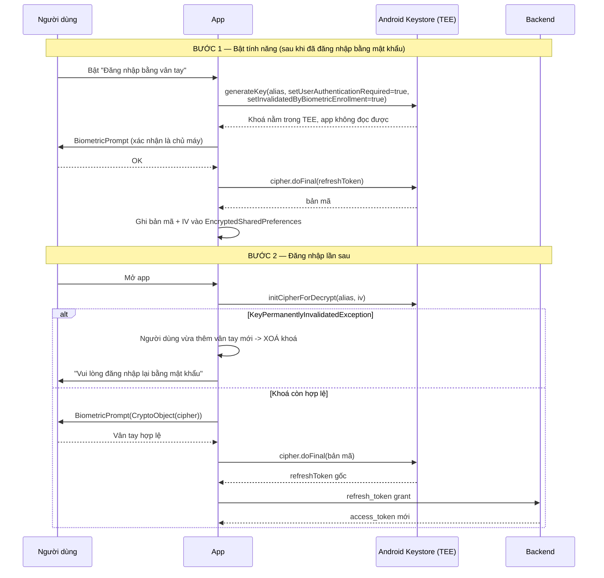
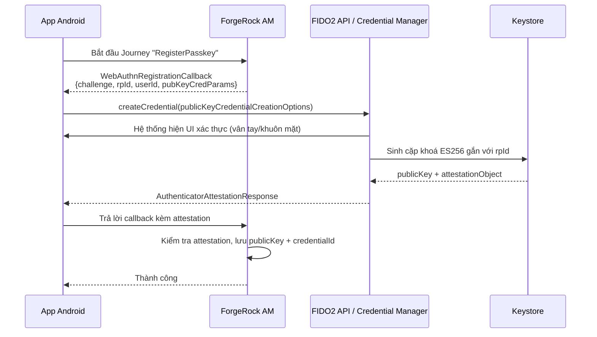
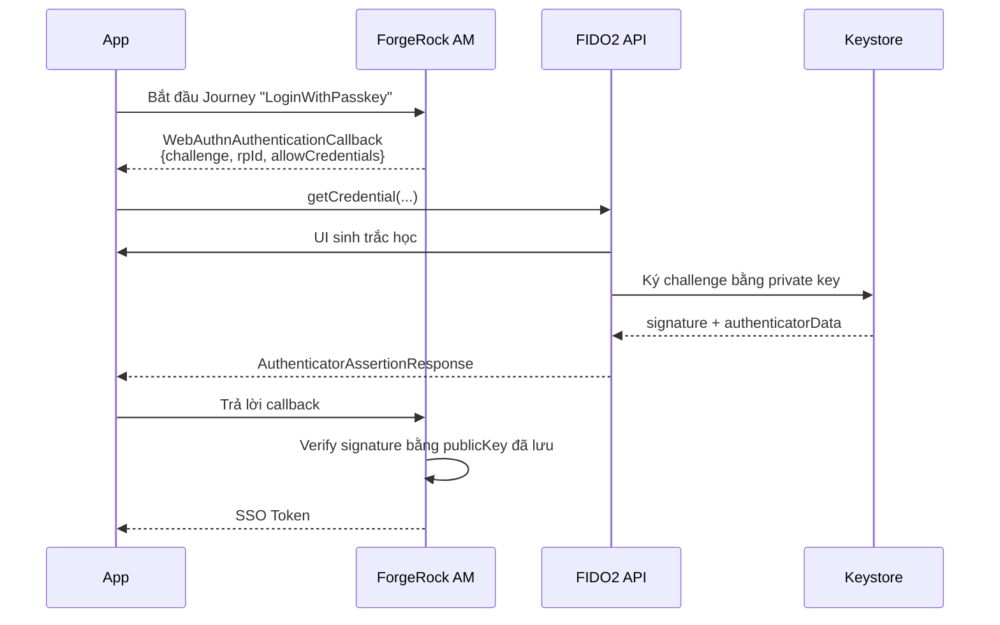

# 02 — Biometric & WebAuthn / Passkey

> Tham chiếu kỹ thuật: [../07-tich-hop/biometric.md](../07-tich-hop/biometric.md).
> Trang này tập trung vào **phần banking**: vì sao "vân tay đúng → cho vào" là cách làm sai, và
> passkey giải quyết chuyện gì.

---

## 1. Sai lầm kinh điển: dùng biometric như một cái `if`

```kotlin
// ❌ CÁCH SAI — 90% tutorial trên mạng viết thế này
biometricPrompt.authenticate(promptInfo)
// onAuthenticationSucceeded:
if (success) {
    navigateToHome()          // vào thẳng home
}
```

Vì sao sai: `onAuthenticationSucceeded` chỉ là **một callback trong tiến trình app**. Trên máy đã
root hoặc app bị hook (Frida), kẻ tấn công gọi thẳng callback đó là vào được. Sinh trắc học ở đây
không bảo vệ **dữ liệu**, chỉ bảo vệ **một câu lệnh `if`**.

```kotlin
// ✅ CÁCH ĐÚNG — sinh trắc học mở khoá một KHOÁ trong Keystore
val cipher = getCipherFromKeystore()               // khoá chỉ dùng được sau khi auth
biometricPrompt.authenticate(promptInfo, BiometricPrompt.CryptoObject(cipher))
// onAuthenticationSucceeded(result):
val unlockedCipher = result.cryptoObject!!.cipher!!
val refreshToken = unlockedCipher.doFinal(encryptedTokenBytes)   // giải mã THẬT
```

**Điểm mấu chốt:** với `CryptoObject`, phần cứng bảo mật (TEE/StrongBox) **từ chối** cho dùng khoá
nếu chưa xác thực thành công. Bỏ qua callback cũng vô ích vì không có khoá thì không giải mã được
token. Đây là câu trả lời làm người phỏng vấn banking gật đầu.

---

## 2. Luồng bật đăng nhập sinh trắc học



### Cấu hình khoá — từng cờ có lý do

```kotlin
val spec = KeyGenParameterSpec.Builder(
    KEY_ALIAS,
    KeyProperties.PURPOSE_ENCRYPT or KeyProperties.PURPOSE_DECRYPT,
)
    .setBlockModes(KeyProperties.BLOCK_MODE_GCM)
    .setEncryptionPaddings(KeyProperties.ENCRYPTION_PADDING_NONE)

    // Bắt buộc xác thực trước mỗi lần dùng khoá
    .setUserAuthenticationRequired(true)

    // ⭐ QUAN TRỌNG NHẤT với banking:
    // thêm/xoá vân tay -> khoá bị huỷ vĩnh viễn.
    // Không có cờ này, người khác thêm vân tay của họ vào máy là đăng nhập được vào app bạn.
    .setInvalidatedByBiometricEnrollment(true)

    // API 30+: chỉ chấp nhận sinh trắc học, KHÔNG chấp nhận mã PIN màn hình khoá
    .apply {
        if (Build.VERSION.SDK_INT >= Build.VERSION_CODES.R) {
            setUserAuthenticationParameters(0, KeyProperties.AUTH_BIOMETRIC_STRONG)
        }
    }

    // Nếu máy có chip bảo mật riêng (Pixel Titan M, Samsung Knox Vault)
    .apply {
        if (Build.VERSION.SDK_INT >= Build.VERSION_CODES.P &&
            context.packageManager.hasSystemFeature(PackageManager.FEATURE_STRONGBOX_KEYSTORE)
        ) {
            setIsStrongBoxBacked(true)
        }
    }
    .build()
```

> ⚠️ **`setIsStrongBoxBacked(true)` có thể ném `StrongBoxUnavailableException` ngay cả khi
> `hasSystemFeature` trả về true** (StrongBox đầy). Luôn bọc try/catch và fallback về TEE thường.
> Đây là lỗi chỉ xuất hiện trên máy thật, không bao giờ thấy trên emulator.

---

## 3. `KeyPermanentlyInvalidatedException` — câu chuyện đáng kể nhất

Đây là lỗi bạn **chắc chắn** đã gặp nếu từng làm biometric thật, và là câu chuyện STAR rất tốt.

**Hiện tượng:** người dùng đang dùng bình thường, tự nhiên báo lỗi đăng nhập sinh trắc học. Log
production chỉ có `InvalidKeyException`. QA không tái hiện được.

**Nguyên nhân:** người dùng vào Cài đặt thêm/xoá một vân tay → Android huỷ mọi khoá có
`setInvalidatedByBiometricEnrollment(true)`. Đây là **hành vi đúng theo thiết kế**, không phải bug.

**Xử lý đúng:**

```kotlin
fun getDecryptCipher(iv: ByteArray): Cipher? = try {
    Cipher.getInstance(TRANSFORMATION).apply {
        init(Cipher.DECRYPT_MODE, getKey(), GCMParameterSpec(TAG_LENGTH, iv))
    }
} catch (e: KeyPermanentlyInvalidatedException) {
    // Sinh trắc học trên máy đã thay đổi -> khoá vô nghĩa
    keyStore.deleteEntry(KEY_ALIAS)
    securePrefs.edit().remove(KEY_ENCRYPTED_TOKEN).apply()
    null    // -> UI chuyển sang yêu cầu đăng nhập bằng mật khẩu và bật lại tính năng
} catch (e: UnrecoverableKeyException) {
    // Xảy ra sau khi khôi phục máy từ backup
    keyStore.deleteEntry(KEY_ALIAS)
    null
}
```

**Bài học kể trong phỏng vấn:** *"Lỗi này dạy em rằng trạng thái bảo mật nằm ngoài app cũng là một
đầu vào phải xử lý. Sau đó em rà lại toàn bộ và thêm hai nhánh nữa: máy bị gỡ hết vân tay, và máy
được khôi phục từ backup."*

---

## 4. Các mức bảo mật sinh trắc học

| Hằng số | Nghĩa | Dùng được `CryptoObject`? |
|---|---|---|
| `BIOMETRIC_STRONG` (Class 3) | FAR ≤ 1/50000, chống spoof tốt | ✅ **Có** |
| `BIOMETRIC_WEAK` (Class 2) | Nhận diện khuôn mặt 2D trên nhiều máy Android | ❌ Không |
| `DEVICE_CREDENTIAL` | PIN/pattern/password màn hình khoá | ✅ Có (nhưng khác cơ chế) |

```kotlin
val canAuth = BiometricManager.from(context)
    .canAuthenticate(BiometricManager.Authenticators.BIOMETRIC_STRONG)

when (canAuth) {
    BiometricManager.BIOMETRIC_SUCCESS -> showPrompt()
    BiometricManager.BIOMETRIC_ERROR_NONE_ENROLLED -> guideUserToEnroll()   // gợi ý mở Settings
    BiometricManager.BIOMETRIC_ERROR_NO_HARDWARE,
    BiometricManager.BIOMETRIC_ERROR_HW_UNAVAILABLE -> hideBiometricButton()
    BiometricManager.BIOMETRIC_ERROR_SECURITY_UPDATE_REQUIRED -> showUpdatePrompt()
}
```

> **Banking phải yêu cầu `BIOMETRIC_STRONG`.** Rất nhiều máy Android tầm trung chỉ có face
> unlock 2D = `BIOMETRIC_WEAK`, mở được bằng ảnh chụp. Nếu app cho phép `WEAK`, kiểm thử bảo mật
> của ngân hàng sẽ đánh trượt. Đây là điểm khác biệt lớn với **iOS Face ID** — Face ID luôn là
> 3D (TrueDepth) nên luôn đủ mạnh, dẫn tới chuyện Android/iOS lệch hành vi
> ([xem 11 §4](11-kho-khan-thuc-te.md)).

---

## 5. WebAuthn / Passkey — bước tiến so với biometric cục bộ

**Khác biệt cốt lõi:**

| | **Biometric cục bộ** | **WebAuthn / Passkey** |
|---|---|---|
| Server có biết không? | Không. Server chỉ thấy một refresh token bình thường | **Có.** Server giữ public key, xác minh chữ ký |
| Chống phishing | Không | ✅ Có — chữ ký gắn với `rpId` (domain) |
| Nếu app bị giả mạo | Vẫn lừa được người dùng | Chữ ký sai `rpId` → server từ chối |
| Bản chất | Mở khoá bí mật đã lưu sẵn | **Ký một challenge** bằng private key |

Passkey = cặp khoá bất đối xứng. **Private key không bao giờ rời khỏi thiết bị**; server chỉ giữ
public key. Không có "mật khẩu" để rò rỉ — đây là lý do FIDO2 được ngành ngân hàng đẩy mạnh.

### Luồng đăng ký (registration / attestation)



### Luồng đăng nhập (authentication / assertion)



### Điều kiện hạ tầng — chỗ hay tốn nhiều ngày nhất

Để passkey chạy trên Android, phải có **Digital Asset Links**:

```json
// Đặt tại https://<domain>/.well-known/assetlinks.json
[{
  "relation": ["delegate_permission/common.get_login_creds"],
  "target": {
    "namespace": "android_app",
    "package_name": "vn.bank.mobile",
    "sha256_cert_fingerprints": ["AA:BB:CC:..."]
  }
}]
```

> ⚠️ **Ba cái bẫy, cả ba đều tốn ngày:**
> 1. `sha256_cert_fingerprints` phải là fingerprint của **chứng chỉ ký thật**. Nếu dùng
>    **Play App Signing**, đó là chứng chỉ của Google, **không phải** keystore của bạn — lấy trong
>    Play Console → Setup → App integrity. Debug build lại dùng debug keystore → phải khai **cả hai**.
> 2. File phải trả về `Content-Type: application/json`, **không được redirect**, phải HTTPS hợp lệ.
> 3. Mỗi flavor có `applicationId` khác nhau (`vn.bank.mobile.sit`, `.uat`, prod) → phải có
>    **3 entry** trong assetlinks. Đây chính là chỗ giao thoa với
>    [trang 10 — flavor](10-flavor-makefile.md), và là lỗi rất hay gặp: passkey chạy ở prod nhưng
>    chết ở SIT.

### API nào: FIDO2 hay Credential Manager?

| | `Fido2ApiClient` (Play Services) | `CredentialManager` (Jetpack, API 34+ / backport) |
|---|---|---|
| Trạng thái | Cũ, vẫn chạy | **Khuyến nghị hiện tại** |
| Đồng bộ passkey qua Google Password Manager | Không | ✅ Có |
| Gộp cả password + passkey + Sign-in-with-Google | Không | ✅ Có |

Nếu bị hỏi "giờ làm lại thì em dùng gì", trả lời **Credential Manager** — và nói rõ nó gộp luôn
Google Sign-In, giải quyết được mớ lộn xộn của `GoogleSignInApi` cũ đã deprecated
([xem 11 §3](11-kho-khan-thuc-te.md)).

---

## 6. Bridge biometric sang Flutter — vì sao không dùng `local_auth`

Package `local_auth` của Flutter **chỉ trả về `true`/`false`**. Nó không cho bạn `CryptoObject`,
tức là rơi đúng vào cái bẫy ở §1. Với app ngân hàng, điều đó không chấp nhận được.

> **Câu trả lời chuẩn khi bị hỏi:** *"Em không dùng `local_auth` vì nó chỉ trả boolean. Em viết
> bridge riêng để phía native thực hiện `CryptoObject` — Dart chỉ nhận về kết quả đã giải mã hoặc
> một mã lỗi, chứ không nhận về một cái boolean quyết định luồng."*

```kotlin
// Chỉ trả sang Dart KẾT QUẢ đã có bảo chứng mật mã, không trả boolean
"authenticateAndUnlock" -> {
    val cipher = keyManager.getDecryptCipher(iv) ?: run {
        result.error("KEY_INVALIDATED", "Sinh trắc học đã thay đổi", null); return
    }
    biometricHelper.authenticate(
        activity, cipher,
        onSuccess = { unlocked ->
            val token = String(unlocked.doFinal(encrypted))
            result.success(token)          // Dart nhận token, không nhận true/false
        },
        onError = { code, msg -> result.error(code, msg, null) },
    )
}
```

---

## 7. Bẫy lifecycle của `BiometricPrompt`

| Bẫy | Hậu quả | Cách xử lý |
|---|---|---|
| Tạo `BiometricPrompt` trong `onResume` | Xoay máy → prompt hiện 2 lần | Tạo trong `onCreate`, giữ tham chiếu |
| Dùng `Executor` tự tạo bằng thread pool | Callback không ở main thread → crash khi update UI | `ContextCompat.getMainExecutor(context)` |
| Không xử lý `ERROR_NEGATIVE_BUTTON` vs `ERROR_USER_CANCELED` | Người dùng bấm "Huỷ" bị coi là lỗi hệ thống | Phân biệt hai mã, `ERROR_LOCKOUT` thì đếm ngược 30s |
| Gọi `authenticate` khi Activity đang `STOPPED` | `IllegalStateException` | Kiểm tra `lifecycle.currentState.isAtLeast(STARTED)` |
| Không xử lý `ERROR_LOCKOUT_PERMANENT` | Người dùng kẹt vĩnh viễn | Bắt buộc fallback sang mật khẩu |

```kotlin
private val promptInfo = BiometricPrompt.PromptInfo.Builder()
    .setTitle(getString(R.string.biometric_title))
    .setSubtitle(getString(R.string.biometric_subtitle))
    // Với CryptoObject, KHÔNG được set allowedAuthenticators có DEVICE_CREDENTIAL
    // cùng lúc trên một số phiên bản -> phải dùng setNegativeButtonText
    .setNegativeButtonText(getString(R.string.action_use_password))
    .setConfirmationRequired(false)   // false: khuôn mặt khớp là xong, đỡ 1 chạm
    .build()
```

---

## Từ khoá phải thuộc

`BiometricPrompt` · `CryptoObject` · `BIOMETRIC_STRONG` (Class 3) vs `WEAK` (Class 2) ·
`KeyGenParameterSpec` · `setUserAuthenticationRequired` · `setInvalidatedByBiometricEnrollment` ·
`KeyPermanentlyInvalidatedException` · `StrongBox` · `TEE` · `FIDO2` · `WebAuthn` · `passkey` ·
`attestation` vs `assertion` · `rpId` · `challenge` · `Digital Asset Links` / `assetlinks.json` ·
`Credential Manager` · `Play App Signing` fingerprint
