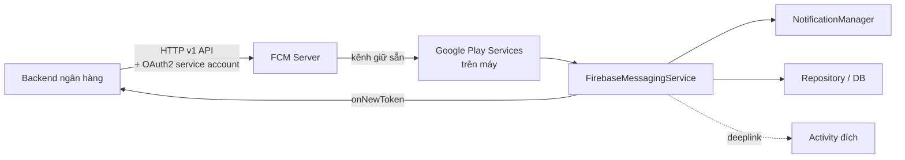
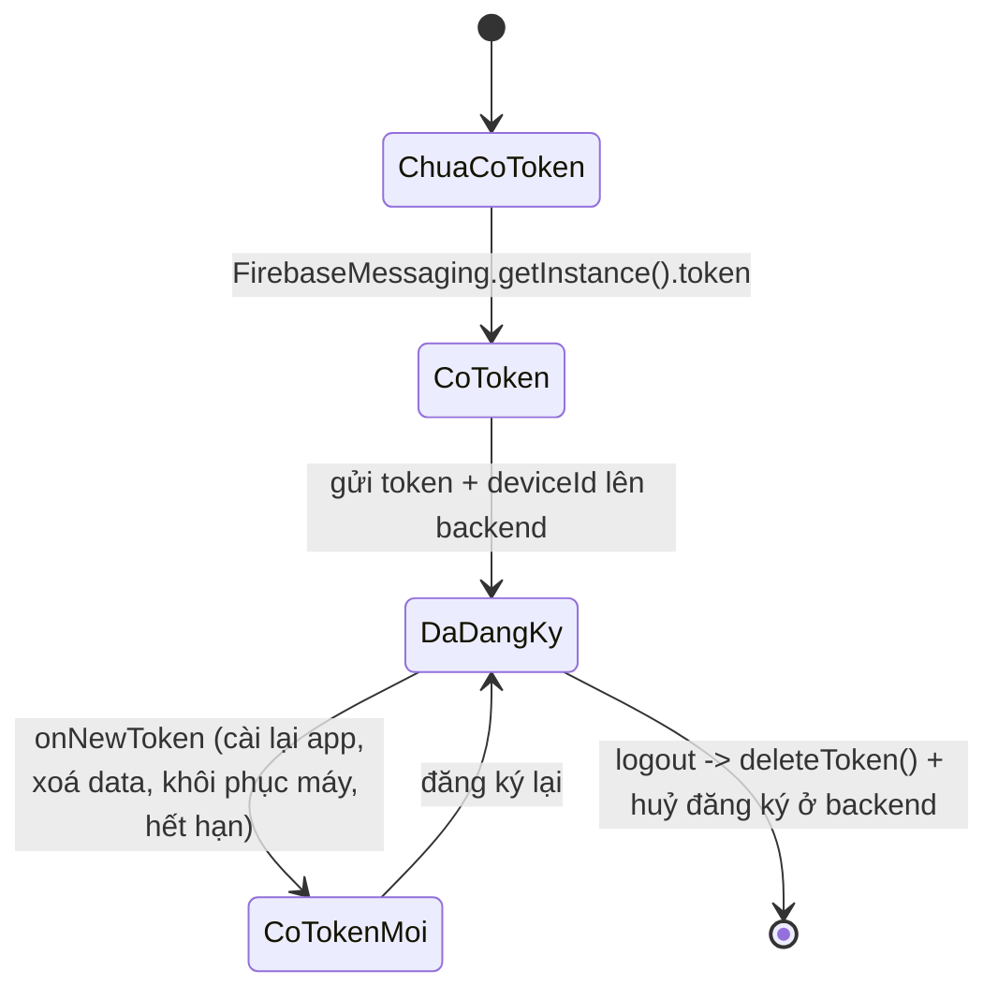
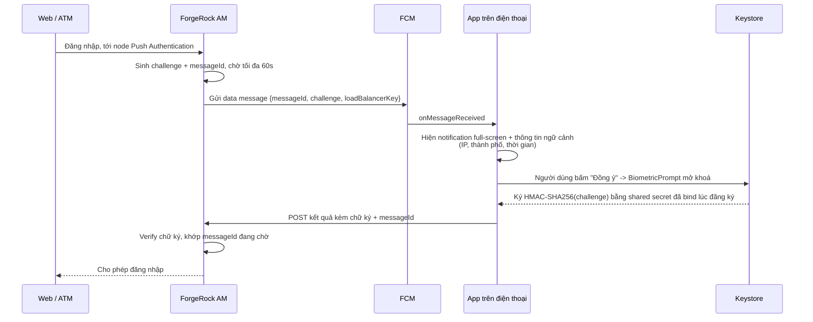
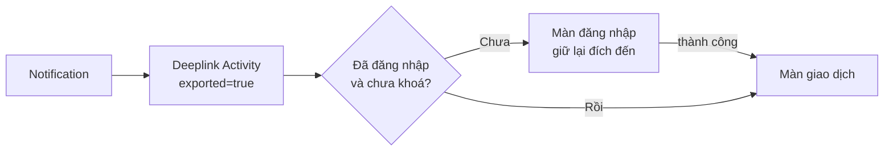

# 03 — FCM & Push Notification

Trong app ngân hàng, push không chỉ là "thông báo khuyến mãi". Nó gánh **ba nghiệp vụ khác nhau**,
và mỗi cái có yêu cầu kỹ thuật riêng:

| Nghiệp vụ | Ví dụ | Yêu cầu |
|---|---|---|
| **Thông báo** | "Tài khoản +5.000.000đ" | Đến được là tốt, trễ vài giây chấp nhận được |
| **Push MFA** | "Xác nhận đăng nhập từ Hà Nội?" | **Bắt buộc đến**, phải ký được, hết hạn 60s |
| **Silent / data sync** | Buộc app tải lại hạn mức | Không hiện gì cho người dùng |

---

## 1. Kiến trúc FCM



**Điểm cần nắm:** FCM **không** kết nối trực tiếp tới app. Google Play Services giữ **một** kết nối
duy nhất cho toàn máy rồi phân phối lại. Đó là lý do:

- Máy Trung Quốc không có Play Services → FCM **không chạy**. Ngân hàng có khách dùng Huawei phải
  tích hợp thêm **HMS Push Kit**. Nói được điều này là điểm cộng thực chiến rất lớn.
- Không thể "ép" FCM gửi ngay — Doze mode gom lại theo cửa sổ.

---

## 2. Data message vs Notification message — câu hỏi ruột

Đây là câu hỏi phân loại ứng viên. Rất nhiều người không biết sự khác biệt.

| | **Notification message** | **Data message** |
|---|---|---|
| Payload | key `notification` | chỉ key `data` |
| App đang **foreground** | `onMessageReceived` được gọi | `onMessageReceived` được gọi |
| App đang **background** | **Hệ thống tự vẽ**, `onMessageReceived` **KHÔNG** được gọi | `onMessageReceived` **vẫn** được gọi |
| App đã **bị kill** (swipe khỏi Recents) | Hệ thống tự vẽ | Được gọi (trừ một số OEM, xem §6) |
| Tuỳ biến giao diện | Hạn chế | ✅ Toàn quyền |
| Ưu tiên | normal | đặt được `high_priority` |

```json
// ❌ Notification message — app không kiểm soát được gì khi ở background
{ "message": { "token": "...", "notification": { "title": "Biến động số dư", "body": "+5.000.000đ" } } }

// ✅ Data-only — app luôn được gọi, tự quyết định vẽ gì
{
  "message": {
    "token": "...",
    "android": { "priority": "HIGH" },
    "data": {
      "type": "TRANSACTION",
      "amount": "5000000",
      "accountId": "0123456789",
      "txnId": "TXN20260812001",
      "deeplink": "bankapp://transaction/TXN20260812001"
    }
  }
}
```

> **Kết luận cho banking: luôn dùng data-only message.** Lý do: (1) cần giải mã / kiểm chữ ký payload
> trước khi hiển thị, (2) cần ghi vào DB để màn hình lịch sử thấy ngay, (3) không được để hệ thống
> hiển thị số tiền khi máy đang khoá nếu người dùng đã tắt tuỳ chọn đó.

---

## 3. Vòng đời token



```kotlin
class BankMessagingService : FirebaseMessagingService() {

    override fun onNewToken(token: String) {
        // ⚠️ Hàm này có thể được gọi khi CHƯA đăng nhập.
        // Lưu lại local, đồng bộ lên server khi có phiên -> tránh mất token.
        pendingTokenStore.save(token)
        if (sessionManager.isLoggedIn) {
            enqueueTokenSync(token)   // WorkManager, KHÔNG gọi thẳng Retrofit
        }
    }
}
```

> ⚠️ **Không gọi API trực tiếp trong `onNewToken`.** Service có thể bị kill bất cứ lúc nào và
> không có mạng lúc đó. Đúng bài là đẩy vào **WorkManager** với ràng buộc `NetworkType.CONNECTED`
> và backoff — đảm bảo cuối cùng token sẽ lên tới server.

**Logout phải `deleteToken()`**, nếu không người dùng tiếp theo trên máy đó vẫn nhận push của người cũ:

```kotlin
suspend fun logout() {
    api.unregisterDevice(deviceId)                 // báo backend trước
    FirebaseMessaging.getInstance().deleteToken().await()
    sessionManager.clear()
}
```

---

## 4. Push MFA — luồng ForgeRock Push Authentication

Đây là chỗ FCM giao với [IAM](01-iam-forgerock.md). Người dùng đăng nhập trên web, điện thoại rung
lên hỏi "Có phải bạn không?".



**Ba điều bắt buộc phải nói khi mô tả luồng này:**

1. **Phải hiện đủ ngữ cảnh** (IP, vị trí, thời gian, thiết bị) — nếu chỉ hỏi "Đồng ý/Từ chối",
   người dùng bấm đồng ý theo phản xạ. Đây là tấn công **MFA fatigue**, đã gây ra nhiều vụ lộ lọt thật.
2. **Number matching** — cách chống MFA fatigue tốt nhất: web hiện số `47`, app bắt người dùng
   chọn đúng `47` trong 3 lựa chọn.
3. **Hết hạn phía server**, không phải phía app. App có bị delay thì server vẫn từ chối sau 60s.

---

## 5. Hiển thị notification đúng cách

```kotlin
override fun onMessageReceived(message: RemoteMessage) {
    // 1. Xác thực nguồn TRƯỚC khi tin payload
    if (!payloadVerifier.isValid(message.data)) {
        Log.w(TAG, "Bỏ qua push có chữ ký không hợp lệ")
        return
    }

    when (message.data["type"]) {
        "TRANSACTION" -> {
            transactionCache.insert(message.data.toTransaction())  // ghi DB trước
            showTransactionNotification(message.data)
        }
        "PUSH_MFA"    -> showFullScreenMfa(message.data)
        "SILENT_SYNC" -> enqueueSyncWork()                          // không hiện gì
        else -> Unit
    }
}

private fun showTransactionNotification(data: Map<String, String>) {
    val intent = Intent(Intent.ACTION_VIEW, data["deeplink"]!!.toUri()).apply {
        // Vào app phải qua cổng kiểm tra phiên, KHÔNG nhảy thẳng màn giao dịch
        setPackage(packageName)
    }
    val pending = PendingIntent.getActivity(
        this, data["txnId"].hashCode(), intent,
        // FLAG_IMMUTABLE bắt buộc từ API 31 — thiếu là crash ngay khi build target 31+
        PendingIntent.FLAG_UPDATE_CURRENT or PendingIntent.FLAG_IMMUTABLE,
    )

    val notification = NotificationCompat.Builder(this, CHANNEL_TRANSACTION)
        .setSmallIcon(R.drawable.ic_notification)
        .setContentTitle(getString(R.string.noti_balance_change))
        .setContentText(formatAmount(data["amount"]))
        // Máy đang khoá thì che nội dung nhạy cảm
        .setVisibility(NotificationCompat.VISIBILITY_PRIVATE)
        .setPublicVersion(buildRedactedVersion())
        .setContentIntent(pending)
        .setAutoCancel(true)
        .build()

    NotificationManagerCompat.from(this).notify(data["txnId"].hashCode(), notification)
}
```

### Notification channel — bắt buộc từ API 26

```kotlin
// Tạo trong Application.onCreate — tạo lại nhiều lần vô hại
val channel = NotificationChannel(
    CHANNEL_TRANSACTION,
    getString(R.string.channel_transaction),
    NotificationManager.IMPORTANCE_HIGH,
).apply {
    description = getString(R.string.channel_transaction_desc)
    lockscreenVisibility = Notification.VISIBILITY_PRIVATE
}
```

> ⚠️ **Không sửa được `importance` của channel sau khi đã tạo** — người dùng là chủ. Muốn đổi thì
> phải xoá channel và tạo channel **id mới**, và làm vậy sẽ mất cài đặt cá nhân hoá của người dùng.
> Vì thế phải thiết kế bộ channel cho đúng **ngay từ bản đầu**. Trong repo này chỉ có một channel
> `ai_assistant_channel` — với banking phải tách ít nhất: giao dịch / bảo mật / khuyến mãi, để
> người dùng tắt riêng khuyến mãi mà không tắt cảnh báo bảo mật.

### Quyền `POST_NOTIFICATIONS` (API 33+)

```kotlin
// Android 13 trở lên: notification là runtime permission
if (Build.VERSION.SDK_INT >= Build.VERSION_CODES.TIRAMISU) {
    requestPermissionLauncher.launch(Manifest.permission.POST_NOTIFICATIONS)
}
```

Repo này khai `POST_NOTIFICATIONS` trong manifest nhưng **chưa có chỗ nào xin quyền** — đúng vấn đề
đã ghi trong [CLAUDE.md](../../CLAUDE.md). Trên Android 13+, không xin thì notification im lặng
không hiện, và **không có lỗi nào cả**.

---

## 6. Vì sao push "không tới" — bảng chẩn đoán

Câu hỏi kinh điển: *"Khách báo không nhận được thông báo, em debug thế nào?"*

| Nguyên nhân | Cách phát hiện | Cách xử lý |
|---|---|---|
| Chưa xin `POST_NOTIFICATIONS` (API 33+) | `NotificationManagerCompat.areNotificationsEnabled()` | Xin quyền + màn hình hướng dẫn |
| Người dùng tắt channel | `getNotificationChannel(id).importance == NONE` | Deeplink tới cài đặt channel |
| **Doze / App Standby** | Test bằng `adb shell dumpsys deviceidle force-idle` | Đặt `priority: HIGH`; nếu thật sự khẩn cấp thì dùng FCM high priority + `setAllowWhileIdle` |
| **OEM battery killer** (Xiaomi, Oppo, Vivo, Huawei) | Chỉ tái hiện trên máy hãng đó | Hướng dẫn người dùng bật "Autostart"; tham chiếu dontkillmyapp.com |
| App bị **force-stop** thủ công | Không nhận gì cho tới khi mở app lại | Không có cách nào khác — đây là thiết kế của Android |
| Token cũ / đã bị đổi | Backend nhận `UNREGISTERED` từ FCM | Backend phải **xoá token chết**, nếu không tỷ lệ gửi hỏng tăng dần |
| Máy không có Play Services | `GoogleApiAvailability.isGooglePlayServicesAvailable()` | Tích hợp HMS Push cho Huawei |
| Sai `google-services.json` giữa các flavor | Package name trong file không khớp `applicationId` | Mỗi flavor một file — [xem trang 10](10-flavor-makefile.md) |

**Cách trả lời hay:** *"Em chia làm 3 lớp — server có gửi không (kiểm tra response FCM và messageId),
máy có nhận không (log `onMessageReceived`), app có vẽ không (kiểm tra channel + quyền). Chỉ cần
khoanh được nó chết ở lớp nào là 80% xong việc."*

---

## 7. Deeplink từ notification — bảo mật



> ⚠️ Activity nhận deeplink **bắt buộc** `exported="true"`, nghĩa là **app khác gọi được**. Không
> bao giờ tin dữ liệu trong Intent. Phải: (1) kiểm tra phiên trước khi điều hướng, (2) không lấy
> số tiền/số tài khoản từ Intent để hiển thị mà phải **gọi lại API bằng `txnId`**, (3) dùng
> **App Links** đã xác thực (`android:autoVerify="true"`) thay vì custom scheme `bankapp://`
> — custom scheme bị app khác đăng ký trùng để cướp link.

---

## Từ khoá phải thuộc

`FirebaseMessagingService` · `onMessageReceived` · `onNewToken` · `data message` vs
`notification message` · `high priority` · `Doze` / `App Standby` · `NotificationChannel` ·
`IMPORTANCE_HIGH` · `POST_NOTIFICATIONS` · `PendingIntent.FLAG_IMMUTABLE` ·
`VISIBILITY_PRIVATE` / `setPublicVersion` · `Push MFA` · `MFA fatigue` · `number matching` ·
`App Links` / `autoVerify` · `HMS Push Kit` · `WorkManager` cho token sync
