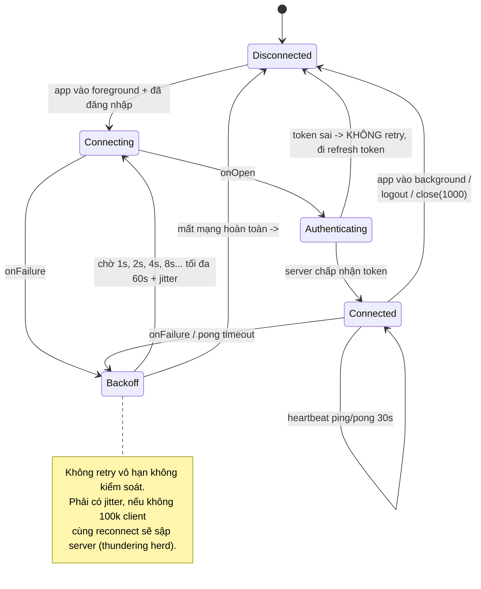

# 04 — WebSocket & realtime

JD ghi rõ **"Tích hợp RESTful API, WebSocket và các dịch vụ liên quan"**. Đây là trang bạn phải
thuộc nhất sau IAM.

---

## 1. Khi nào WebSocket, khi nào không

| Nhu cầu | Giải pháp đúng | Vì sao |
|---|---|---|
| Lấy danh sách tài khoản | **REST** | Request/response một lần, cache được |
| Tỷ giá / giá vàng nhảy liên tục | **WebSocket** | Server đẩy, tần suất cao |
| Biến động số dư khi app đang mở | **WebSocket** | Cần tức thời |
| Biến động số dư khi app đã đóng | **FCM** | WebSocket chết khi app bị kill |
| Trạng thái duyệt lệnh chuyển tiền (30–60s) | WebSocket, hoặc **long polling** nếu hạ tầng không cho | Tránh polling 1s/lần |
| Chat với tư vấn viên | **WebSocket** | Hai chiều |
| Tải sao kê PDF | **REST** | File lớn, cần resume |

> **Câu chốt:** *"WebSocket và FCM không thay thế nhau. WebSocket lo lúc app mở, FCM lo lúc app
> đóng. App banking cần cả hai và phải có cơ chế hoà giải khi cả hai cùng báo một sự kiện —
> em khử trùng lặp bằng `eventId` ở tầng repository."*

Bảng so sánh cần thuộc:

| | Polling | Long polling | SSE | **WebSocket** |
|---|---|---|---|---|
| Chiều | Client hỏi | Client hỏi, server giữ | Server → Client | **Hai chiều** |
| Giao thức | HTTP | HTTP | HTTP | TCP nâng cấp từ HTTP (`101 Switching Protocols`) |
| Overhead | Cao nhất | Trung bình | Thấp | Thấp nhất sau khi bắt tay |
| Qua proxy/firewall ngân hàng | Dễ | Dễ | Dễ | **Hay bị chặn** — phải dùng `wss://` cổng 443 |

---

## 2. Vòng đời kết nối — sơ đồ phải vẽ được



---

## 3. Cài đặt bằng OkHttp — bản đầy đủ

```kotlin
class RealtimeClient(
    private val okHttpClient: OkHttpClient,
    private val sessionManager: SessionManager,
    private val scope: CoroutineScope,
) {
    private var webSocket: WebSocket? = null
    private var retryCount = 0
    private var pongJob: Job? = null

    private val _events = MutableSharedFlow<RealtimeEvent>(
        replay = 0,
        extraBufferCapacity = 64,
        onBufferOverflow = BufferOverflow.DROP_OLDEST,  // tỷ giá cũ bỏ được, không chặn producer
    )
    val events: SharedFlow<RealtimeEvent> = _events.asSharedFlow()

    private val _state = MutableStateFlow(ConnectionState.DISCONNECTED)
    val state: StateFlow<ConnectionState> = _state.asStateFlow()

    fun connect() {
        if (webSocket != null) return                       // chống mở trùng
        val token = sessionManager.accessToken ?: return

        _state.value = ConnectionState.CONNECTING
        val request = Request.Builder()
            .url(BuildConfig.WS_URL)
            // Gửi token qua HEADER, KHÔNG qua query string
            .addHeader("Authorization", "Bearer $token")
            .build()

        webSocket = okHttpClient.newWebSocket(request, listener)
    }

    private val listener = object : WebSocketListener() {

        override fun onOpen(webSocket: WebSocket, response: Response) {
            retryCount = 0
            _state.value = ConnectionState.CONNECTED
            subscribe(listOf("balance", "fx_rate"))
            startHeartbeat()
        }

        override fun onMessage(webSocket: WebSocket, text: String) {
            // ⚠️ Chạy trên thread của OkHttp, KHÔNG phải main thread
            runCatching { json.decodeFromString<RealtimeEvent>(text) }
                .onSuccess { _events.tryEmit(it) }
                .onFailure { Log.w(TAG, "Payload lạ, bỏ qua: $text") }   // không được crash
        }

        override fun onClosing(webSocket: WebSocket, code: Int, reason: String) {
            webSocket.close(NORMAL_CLOSURE, null)
            _state.value = ConnectionState.DISCONNECTED
        }

        override fun onFailure(webSocket: WebSocket, t: Throwable, response: Response?) {
            this@RealtimeClient.webSocket = null
            stopHeartbeat()
            when (response?.code) {
                401, 403 -> {
                    // Token hết hạn: KHÔNG reconnect ngay, sẽ 401 vô hạn.
                    _state.value = ConnectionState.UNAUTHORIZED
                    scope.launch { if (tokenRefresher.refresh()) connect() }
                }
                else -> scheduleReconnect()
            }
        }
    }

    private fun scheduleReconnect() {
        _state.value = ConnectionState.RECONNECTING
        val base = min(MAX_DELAY_MS, INITIAL_DELAY_MS * (1L shl retryCount))
        val jitter = Random.nextLong(0, base / 2)          // tránh thundering herd
        retryCount = min(retryCount + 1, MAX_RETRY_EXP)
        scope.launch { delay(base + jitter); connect() }
    }

    private fun startHeartbeat() {
        pongJob = scope.launch {
            while (isActive) {
                delay(HEARTBEAT_MS)
                val ok = webSocket?.send("""{"type":"ping"}""") ?: false
                if (!ok) { disconnect(); scheduleReconnect(); break }
            }
        }
    }

    fun disconnect() {
        stopHeartbeat()
        webSocket?.close(NORMAL_CLOSURE, "Người dùng rời màn hình")
        webSocket = null
        _state.value = ConnectionState.DISCONNECTED
    }

    private companion object {
        const val NORMAL_CLOSURE = 1000
        const val INITIAL_DELAY_MS = 1_000L
        const val MAX_DELAY_MS = 60_000L
        const val MAX_RETRY_EXP = 6
        const val HEARTBEAT_MS = 30_000L
    }
}
```

### `pingInterval` của OkHttp có đủ không?

```kotlin
OkHttpClient.Builder().pingInterval(30, TimeUnit.SECONDS).build()
```

Đây là **ping ở tầng giao thức WebSocket** (opcode 0x9). Nó phát hiện được đứt kết nối TCP, nhưng
**không** phát hiện được "server còn sống nhưng luồng nghiệp vụ đã treo". Nhiều hệ thống ngân hàng
có load balancer trả lời pong thay cho backend đã chết. Vì thế cần **heartbeat tầng ứng dụng**
(ping/pong JSON có `messageId`) như code trên. Nói được điểm này là rất "thực chiến".

---

## 4. Gắn với lifecycle — chỗ hay rò rỉ nhất

```kotlin
// Trong Activity/Fragment: kết nối chỉ sống khi màn hình đang hiện
class DashboardActivity : AppCompatActivity() {

    override fun onCreate(savedInstanceState: Bundle?) {
        super.onCreate(savedInstanceState)

        lifecycleScope.launch {
            repeatOnLifecycle(Lifecycle.State.STARTED) {
                realtimeClient.connect()                        // vào STARTED: mở
                try {
                    realtimeClient.events.collect(::render)
                } finally {
                    realtimeClient.disconnect()                 // rời STARTED: đóng
                }
            }
        }
    }
}
```

**Vì sao không để `Application` giữ kết nối mãi:**

- Tốn pin và data — ngân hàng bị người dùng phàn nàn về pin rất nhiều.
- Android sẽ giết socket khi vào Doze, mà app không hay biết → hiển thị số dư cũ mà tưởng là mới.
- Sau khi khoá màn hình, token có thể đã hết hạn.

**Nhưng** nếu nhiều màn hình cùng cần realtime, đóng/mở liên tục khi chuyển tab cũng dở. Giải pháp
tốt: đặt client ở tầng **repository singleton**, dùng `shareIn(started = SharingStarted.WhileSubscribed(5_000))`
— giữ kết nối thêm 5 giây sau khi màn hình cuối rời đi, đủ để chuyển tab không bị ngắt.

```kotlin
val balanceStream: SharedFlow<Balance> = realtimeClient.events
    .filterIsInstance<RealtimeEvent.BalanceChanged>()
    .map { it.toBalance() }
    .shareIn(scope, SharingStarted.WhileSubscribed(5_000), replay = 1)
```

Đây chính là cùng một kỹ thuật `WhileSubscribed(5000)` đang dùng trong `PersonalViewModel` của repo
này — nói được là bạn **đã dùng** nó thì rất thuyết phục.

---

## 5. STOMP over WebSocket

Nhiều backend ngân hàng viết bằng Spring dùng **STOMP** chứ không phải WebSocket trần. STOMP là
giao thức nhắn tin dạng frame text nằm **trên** WebSocket, có `SUBSCRIBE` / `SEND` / `MESSAGE` /
`ACK`, hợp với mô hình topic.

```
CONNECT
accept-version:1.2
Authorization:Bearer eyJ...

^@

SUBSCRIBE
id:sub-0
destination:/user/queue/balance

^@
```

Thư viện Android hay dùng: `StompProtocolAndroid` (cũ, ít bảo trì) hoặc tự viết frame parser trên
OkHttp — thực tế nhiều đội chọn cách thứ hai vì frame STOMP rất đơn giản.

**Điểm phải nhớ:** STOMP có `heart-beat:10000,10000` trong header CONNECT — thoả thuận nhịp tim hai
chiều ngay lúc bắt tay. Nếu không set, kết nối chết âm thầm.

---

## 6. Bảo mật WebSocket trong ngân hàng

| Điểm | Yêu cầu |
|---|---|
| Giao thức | **`wss://`** bắt buộc. `ws://` là plaintext, tuyệt đối không |
| Truyền token | Qua **header** `Authorization`. Query string bị ghi vào access log của proxy |
| Certificate pinning | Áp dụng cả cho WebSocket — dùng chung `OkHttpClient` đã pin |
| Token hết hạn giữa chừng | Server phải chủ động `close(4001)`; app refresh rồi mở lại |
| Bản tin nhạy cảm | Chỉ đẩy **sự kiện + id**, client gọi REST lấy chi tiết. Đừng đẩy số dư đầy đủ qua kênh giữ mở lâu |
| Chống replay | Mỗi message có `eventId` + `timestamp`; client bỏ qua id đã xử lý |
| Giới hạn kích thước | `okHttpClient` mặc định 16MB — hạ xuống để chống DoS bộ nhớ |

> ⚠️ Nhiều mạng doanh nghiệp/ngân hàng có proxy chặn `Upgrade: websocket`. Phải có **fallback sang
> long polling** hoặc ít nhất báo lỗi rõ ràng. Đây là loại lỗi chỉ xuất hiện trong môi trường
> khách hàng, không bao giờ thấy ở máy dev — kể được là rất "thực chiến".

---

## 7. Test và debug WebSocket

| Việc | Công cụ |
|---|---|
| Thử tay endpoint | **Postman** (hỗ trợ WebSocket từ v9), `websocat`, `wscat` |
| Xem frame thật | **Charles / Proxyman** (phải cài CA cert; **cert pinning sẽ chặn** → cần build debug có `networkSecurityConfig` riêng) |
| Giả lập mất mạng | `adb shell svc wifi disable`, Android Studio Network Profiler |
| Giả lập mạng chậm | Charles throttling, hoặc emulator `-netdelay gsm -netspeed edge` |
| Test reconnect | Chặn cổng bằng firewall rồi mở lại, xem có backoff đúng không |

```xml
<!-- src/debug/res/xml/network_security_config.xml -->
<!-- CHỈ ở buildType debug: cho phép Charles đọc traffic -->
<network-security-config>
    <debug-overrides>
        <trust-anchors>
            <certificates src="system" />
            <certificates src="user" />   <!-- CA do Charles cài -->
        </trust-anchors>
    </debug-overrides>
</network-security-config>
```

---

## 8. Câu hỏi hay bị vặn

**"Mạng chập chờn, làm sao biết mất bao nhiêu message?"**
Server đánh số thứ tự (`seq`). Khi reconnect, client gửi `lastSeq` đã nhận, server phát lại phần
thiếu. Không có cơ chế này thì reconnect xong dữ liệu bị hổng mà không ai biết.

**"WebSocket có cần retry như REST không?"**
Khác nhau. REST retry **một request**. WebSocket retry **cả kết nối**, và phải re-subscribe lại
toàn bộ topic sau khi mở lại — quên bước này là triệu chứng "kết nối xanh nhưng không có dữ liệu",
lỗi rất hay gặp.

**"Nhiều màn hình cùng cần realtime thì mở mấy kết nối?"**
**Một.** Một `WebSocket` singleton ở tầng data, các màn hình subscribe qua `SharedFlow` và tự lọc.
Mở nhiều kết nối tới cùng một server là dấu hiệu kiến trúc sai và làm server tốn tài nguyên gấp N lần.

**"Xoay màn hình thì sao?"**
Nếu client nằm trong ViewModel thì `onCleared` không bị gọi khi xoay → kết nối giữ nguyên, tốt.
Nếu để trong Activity thì mỗi lần xoay là ngắt/mở lại — đó là lý do phải đặt ở tầng repository.

---

## Từ khoá phải thuộc

`ws://` vs `wss://` · `101 Switching Protocols` · `WebSocketListener` · `onOpen/onMessage/onFailure/onClosing` ·
`exponential backoff` + `jitter` · `thundering herd` · `heartbeat` ping/pong · `pingInterval` ·
`close code 1000` · `STOMP` · `SharedFlow` vs `StateFlow` · `shareIn(WhileSubscribed)` ·
`BufferOverflow.DROP_OLDEST` · `re-subscribe sau reconnect` · `sequence number` / gap detection ·
`long polling` · `SSE`
