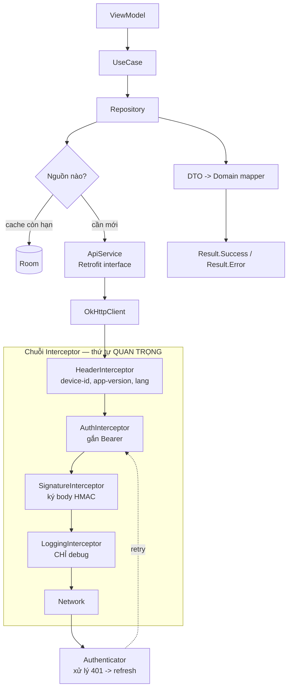

# 05 — Handle API & bảo mật tầng mạng

> Nền tảng Retrofit/OkHttp: [../07-tich-hop/networking-retrofit.md](../07-tich-hop/networking-retrofit.md).
> Trang này thêm phần **banking**: refresh token đúng cách, cert pinning, ký request, idempotency.

---

## 1. Kiến trúc tầng mạng



**Thứ tự interceptor có ý nghĩa:** `LoggingInterceptor` phải đặt **cuối cùng** trong danh sách
application interceptor để log ra request **đã có đủ header** — đặt đầu thì log ra request trống.
Ngược lại, `SignatureInterceptor` phải chạy **sau** `AuthInterceptor` nếu chữ ký bao gồm cả header
Authorization.

---

## 2. `Interceptor` vs `Authenticator` — phân biệt

| | `Interceptor` | `Authenticator` |
|---|---|---|
| Khi nào chạy | **Mọi** request | **Chỉ khi** server trả `401` |
| OkHttp tự retry? | Không | ✅ Có, tự gửi lại request |
| Chống lặp vô hạn | Tự lo | ✅ Có sẵn (`response.priorResponse`) |
| Dùng cho | Gắn header, log, đo thời gian | **Refresh token** |

Rất nhiều người tự viết refresh trong `Interceptor` rồi phải tự làm retry + chống lặp. Biết dùng
`Authenticator` là dấu hiệu đã làm thật.

---

## 3. Refresh token single-flight — câu hỏi khó nhất về networking

**Tình huống:** màn hình Dashboard gọi 5 API song song. Access token vừa hết hạn. Cả 5 cùng nhận
`401`. Nếu mỗi cái tự đi refresh → **5 lần refresh song song**. Với **refresh token rotation**,
lần đầu thành công sẽ vô hiệu hoá token cũ → 4 lần còn lại thất bại → server nghi ngờ bị đánh cắp
token → **huỷ toàn bộ phiên** → người dùng bị đá ra ngoài giữa lúc đang dùng.

Đây là bug production kinh điển của app ngân hàng. Lời giải: **chỉ một request refresh tại một thời
điểm**, các request khác chờ kết quả đó.

```kotlin
class TokenAuthenticator(
    private val sessionManager: SessionManager,
    private val refreshApi: Lazy<RefreshApi>,   // Lazy để tránh phụ thuộc vòng
) : Authenticator {

    private val mutex = Mutex()

    override fun authenticate(route: Route?, response: Response): Request? {
        // 1. Đã retry rồi mà vẫn 401 -> chịu thua, tránh lặp vô hạn
        if (response.priorResponse != null) return null

        val failedToken = response.request.header("Authorization")
            ?.removePrefix("Bearer ")

        return runBlocking {          // Authenticator là API đồng bộ của OkHttp
            mutex.withLock {
                val current = sessionManager.accessToken

                // 2. Trong lúc chờ mutex, một request khác có thể đã refresh xong.
                //    So sánh token: nếu đã đổi -> dùng luôn, KHÔNG refresh lần nữa.
                if (current != null && current != failedToken) {
                    return@withLock response.request.newBuilder()
                        .header("Authorization", "Bearer $current")
                        .build()
                }

                // 3. Mình là người đầu tiên -> thực hiện refresh
                val refresh = sessionManager.refreshToken ?: return@withLock null
                when (val result = runCatching { refreshApi.value.refresh(refresh) }) {
                    else -> result.fold(
                        onSuccess = { body ->
                            sessionManager.save(body.accessToken, body.refreshToken)
                            response.request.newBuilder()
                                .header("Authorization", "Bearer ${body.accessToken}")
                                .build()
                        },
                        onFailure = {
                            // Refresh token cũng chết -> logout toàn cục
                            sessionManager.clear()
                            appEventBus.tryEmit(AppEvent.SessionExpired)
                            null
                        },
                    )
                }
            }
        }
    }
}
```

**Ba chi tiết phải giải thích được:**

1. `mutex.withLock` — chỉ một luồng refresh.
2. **So sánh token cũ với token hiện tại** — đây là mấu chốt. Nếu không có bước này, 5 request sẽ
   lần lượt vào mutex và refresh 5 lần **tuần tự** (vẫn sai, chỉ là chậm hơn).
3. `response.priorResponse != null` — chống lặp vô hạn khi refresh xong vẫn 401.

> ⚠️ `refreshApi` phải dùng **`OkHttpClient` riêng, KHÔNG gắn `Authenticator` này**, nếu không
> refresh bị 401 sẽ gọi lại chính nó → đệ quy. Đây là lỗi thiết kế rất hay gặp.

---

## 4. Xử lý lỗi — một chỗ cho cả app

Repo này đã có sẵn khuôn: `data/SafeApiCall.kt` + `data/AppException.kt`. Mở rộng cho banking:

```kotlin
enum class Kind {
    NETWORK,          // mất mạng, timeout
    SERVER,           // 5xx
    UNAUTHORIZED,     // 401/403 sau khi refresh cũng hỏng
    VALIDATION,       // 400 kèm mã lỗi nghiệp vụ
    INSUFFICIENT_FUNDS,   // nghiệp vụ: không đủ số dư
    LIMIT_EXCEEDED,       // nghiệp vụ: vượt hạn mức
    OTP_INVALID,
    MAINTENANCE,      // 503 + header bảo trì
    UNKNOWN,
}
```

**Nguyên tắc vàng:** tầng data phân loại lỗi thành `Kind`, **không** biết `R.string` là gì. Tầng UI
ánh xạ `Kind` → chuỗi hiển thị. Nhờ vậy đổi ngôn ngữ / đổi giọng văn không phải sờ vào repository.
Repo này làm đúng thế trong `ui/common/ErrorMessages.kt`.

> **Với banking, phải phân biệt lỗi kỹ thuật và lỗi nghiệp vụ.** "Không đủ số dư" là **kết quả hợp
> lệ** của nghiệp vụ, không phải exception. Nhiều đội nhét hết vào `catch` rồi hiện "Đã có lỗi xảy
> ra" — người dùng không hiểu gì. Backend trả `errorCode` → map sang thông báo cụ thể.

### Timeout đặt bao nhiêu?

| Loại request | connect | read | Lý do |
|---|---|---|---|
| API thường | 15s | 20s | Người dùng chờ được |
| Chuyển tiền | 15s | **60s** | Core banking chậm, cắt sớm là nguy hiểm |
| Upload ảnh eKYC | 30s | 120s | File lớn |

> ⚠️ **Timeout của lệnh chuyển tiền là câu hỏi bẫy.** Nếu app timeout nhưng server **đã thực hiện**
> thì sao? Người dùng bấm lại → **chuyển tiền hai lần**. Lời giải: **idempotency key**.

```kotlin
// Client sinh key duy nhất cho MỖI Ý ĐỊNH chuyển tiền, giữ nguyên qua mọi lần retry
@POST("transfers")
suspend fun transfer(
    @Header("Idempotency-Key") key: String,   // UUID sinh 1 lần, lưu vào DB cùng lệnh
    @Body body: TransferRequest,
): TransferResponse
```

Server thấy key đã xử lý → trả lại **kết quả cũ** thay vì thực hiện lần nữa. Và **quan trọng**:
với lệnh chuyển tiền, khi timeout **tuyệt đối không tự động retry** — phải gọi API tra cứu trạng
thái lệnh, rồi mới quyết định. Nói được đoạn này là ghi điểm rất mạnh trong phỏng vấn banking.

---

## 5. Retry đúng cách

```kotlin
suspend fun <T> retryWithBackoff(
    times: Int = 3,
    initialDelay: Long = 500,
    factor: Double = 2.0,
    block: suspend () -> T,
): T {
    var delayMs = initialDelay
    repeat(times - 1) {
        try {
            return block()
        } catch (e: IOException) {
            // CHỈ retry lỗi mạng và CHỈ với request idempotent (GET)
        } catch (e: CancellationException) {
            throw e                    // luôn phải rethrow, nếu không huỷ coroutine hỏng
        }
        delay(delayMs + Random.nextLong(0, delayMs / 2))   // jitter
        delayMs = (delayMs * factor).toLong()
    }
    return block()
}
```

| Method | Có được retry tự động? |
|---|---|
| `GET`, `HEAD` | ✅ Có (idempotent theo định nghĩa) |
| `PUT`, `DELETE` | ✅ Thường được |
| **`POST`** | ❌ **Không**, trừ khi có `Idempotency-Key` |

---

## 6. Bảo mật tầng mạng — checklist ngân hàng

### 6.1 Certificate pinning

```kotlin
val pinner = CertificatePinner.Builder()
    .add("api.bank.vn", "sha256/AAAAAAAAAAAAAAAAAAAAAAAAAAAAAAAAAAAAAAAAAAA=")
    .add("api.bank.vn", "sha256/BBBBBBBBBBBBBBBBBBBBBBBBBBBBBBBBBBBBBBBBBBB=")  // pin dự phòng
    .build()
```

> ⚠️ **Luôn khai ít nhất 2 pin**, trong đó một cái là chứng chỉ dự phòng chưa dùng. Chỉ pin một cái,
> đến ngày ngân hàng gia hạn chứng chỉ là **toàn bộ app ngoài thị trường chết đồng loạt**, và cách
> duy nhất để sửa là phát hành bản mới rồi chờ người dùng cập nhật. Đây là sự cố có thật ở nhiều
> ngân hàng và là câu chuyện rất đáng kể.
>
> Nên pin theo **intermediate CA** thay vì leaf certificate — gia hạn leaf không làm hỏng pin.
> Cân nhắc `network_security_config.xml` với `<pin-set expiration="2027-01-01">` để có đường lùi.

### 6.2 Ký request (request signing)

Nhiều ngân hàng yêu cầu ký body để chống sửa đổi giữa đường (kể cả khi TLS bị can thiệp):

```kotlin
class SignatureInterceptor(private val keyProvider: KeyProvider) : Interceptor {
    override fun intercept(chain: Interceptor.Chain): Response {
        val request = chain.request()
        val timestamp = System.currentTimeMillis().toString()
        val nonce = UUID.randomUUID().toString()      // chống replay
        val bodyString = request.body?.let { buffer(it) } ?: ""

        val payload = "${request.method}|${request.url.encodedPath}|$timestamp|$nonce|$bodyString"
        val signature = hmacSha256(payload, keyProvider.signingKey)

        return chain.proceed(
            request.newBuilder()
                .addHeader("X-Timestamp", timestamp)
                .addHeader("X-Nonce", nonce)
                .addHeader("X-Signature", signature)
                .build()
        )
    }
}
```

Server kiểm tra: chữ ký khớp, `timestamp` lệch < 5 phút, `nonce` chưa từng thấy.

### 6.3 Checklist còn lại

| Hạng mục | Cách làm |
|---|---|
| Chặn cleartext | `android:usesCleartextTraffic="false"` + `networkSecurityConfig` |
| Không log ở release | `HttpLoggingInterceptor` bọc `if (BuildConfig.DEBUG)` — repo này đã làm đúng |
| Không đưa secret vào code | `local.properties` → `buildConfigField`; secret thật thì để backend |
| Chống root/emulator | Play Integrity API; kết quả gửi backend quyết định, **không** tự quyết ở client |
| Obfuscate | R8/ProGuard + `-keep` cho model dùng phản chiếu (Gson) |
| Chống chụp màn hình | `FLAG_SECURE` ở màn nhạy cảm |
| Xoá dữ liệu khi gỡ | `allowBackup=false`, `dataExtractionRules` |
| SSL bypass tool | Phát hiện Frida/Xposed cơ bản; chấp nhận là chỉ làm chậm kẻ tấn công |

> **Câu hỏi hay:** *"Cert pinning có chống được người dùng tự cài CA để xem traffic không?"*
> Có — đó chính là mục đích. Nhưng nó cũng chặn luôn **đội QA** dùng Charles. Vì thế phải tắt pinning
> ở `buildType debug` bằng `network_security_config` riêng, chứ đừng tắt bằng cách sửa code.

---

## 7. Tối ưu hiệu năng tầng mạng

| Kỹ thuật | Hiệu quả |
|---|---|
| **HTTP cache** (`Cache-Control`, ETag) | Danh mục ngân hàng, danh sách tỉnh/thành → tiết kiệm hẳn request |
| **Gộp request** | Dashboard gọi 5 API → xin backend làm 1 endpoint tổng hợp (BFF) |
| **`gzip`** | OkHttp tự bật, nhưng backend phải bật `Content-Encoding` |
| **Connection pool** | Dùng **một** `OkHttpClient` cho cả app — tạo nhiều instance là lỗi hiệu năng phổ biến nhất |
| **Prefetch** | Tải trước dữ liệu Dashboard ngay khi login thành công |
| **Phân trang** | Lịch sử giao dịch dùng Paging 3, không tải hết |
| **Huỷ request** | `viewModelScope` tự huỷ khi rời màn — tránh tải thứ không ai xem |

> **Một `OkHttpClient` dùng chung, các cấu hình khác nhau thì `newBuilder()`:**
> ```kotlin
> val longTimeoutClient = baseClient.newBuilder()
>     .readTimeout(60, TimeUnit.SECONDS)
>     .build()   // vẫn dùng chung connection pool + dispatcher
> ```

---

## 8. Postman & Swagger (JD có nhắc)

| Công cụ | Dùng để làm gì trong thực tế |
|---|---|
| **Swagger / OpenAPI** | Nguồn sự thật về hợp đồng API. Đọc để biết field nào nullable — **nguyên nhân crash số 1** khi map DTO |
| **Postman** | Thử API trước khi code; **Environment** cho 3 môi trường SIT/UAT/PROD; **Pre-request Script** tự lấy token; **Collection Runner** để smoke test |
| **Mock server** | Backend chưa xong vẫn code được UI — nói được điều này thể hiện bạn biết làm việc song song với BE |

```javascript
// Postman Pre-request Script: tự động lấy token trước mỗi request
pm.sendRequest({
    url: pm.environment.get("auth_url") + "/oauth2/access_token",
    method: 'POST',
    header: { 'Content-Type': 'application/x-www-form-urlencoded' },
    body: { mode: 'urlencoded', urlencoded: [
        { key: 'grant_type', value: 'password' },
        { key: 'username',  value: pm.environment.get("user") },
        { key: 'password',  value: pm.environment.get("pass") },
    ]}
}, (err, res) => pm.environment.set("access_token", res.json().access_token));
```

**Mẹo trả lời:** *"Em luôn yêu cầu BE cung cấp Swagger trước khi bắt đầu. Field nullable trong
Swagger mà DTO khai non-null là nguyên nhân crash phổ biến nhất — nên DTO của em **mọi field đều
nullable**, rồi mới validate khi map sang domain model."* Đây đúng là cách các DTO trong repo này
được viết.

---

## Từ khoá phải thuộc

`Retrofit` · `OkHttp` · `Interceptor` vs `Authenticator` · `single-flight refresh` · `Mutex` ·
`priorResponse` · `refresh token rotation` · `Idempotency-Key` · `exponential backoff` + `jitter` ·
`CertificatePinner` · `intermediate CA pinning` · `network_security_config` · `HMAC-SHA256` ·
`nonce` · `replay attack` · `Play Integrity` · `R8/ProGuard` · `ETag` / `Cache-Control` ·
`connection pool` · `BFF` · `Swagger/OpenAPI` · `Postman Environment`
