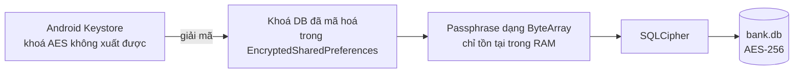
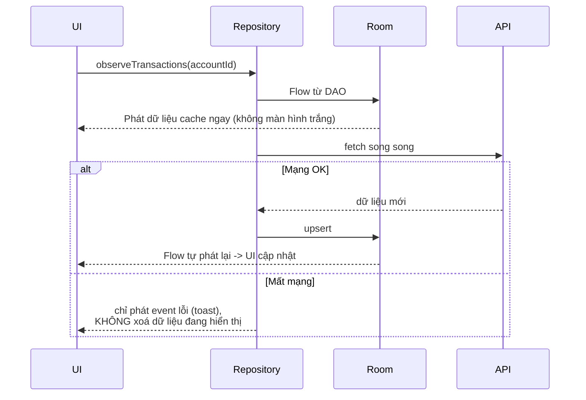

# 06 — SQLite & lưu trữ dữ liệu

> Nền tảng Room/DataStore: [../05-jetpack/room-datastore.md](../05-jetpack/room-datastore.md).
> Trang này thêm: **chọn nơi lưu cho đúng**, mã hoá DB, offline-first, migration khi lên production.

---

## 1. Lưu ở đâu — bảng quyết định

Câu hỏi phỏng vấn: *"App em lưu những gì ở local?"* Trả lời gộp "em dùng SharedPreferences" là trượt.

| Dữ liệu | Nơi lưu đúng | Vì sao |
|---|---|---|
| `access_token` | **RAM** (biến trong `SessionManager`) | Sống 5–15 phút, ghi đĩa là thừa rủi ro |
| `refresh_token` | `EncryptedSharedPreferences` | Cần sống qua lần mở app, phải mã hoá |
| Khoá mã hoá | **Android Keystore** (StrongBox nếu có) | Khoá không được rời khỏi phần cứng bảo mật |
| Cờ "đã bật vân tay", ngôn ngữ, theme | `DataStore Preferences` | Không nhạy cảm, cần bất đồng bộ + type-safe |
| Cache lịch sử giao dịch | **Room** (+ SQLCipher) | Dữ liệu quan hệ, cần truy vấn/lọc/phân trang |
| Danh mục ngân hàng, tỉnh/thành | Room, có TTL | Ít đổi, tải lại theo phiên bản |
| Ảnh eKYC tạm | `cacheDir` **có mã hoá**, xoá ngay sau khi upload | Không được nằm lại trên máy |
| Số dư | **Không lưu**, hoặc lưu có TTL rất ngắn + đánh dấu "dữ liệu lúc HH:mm" | Hiện số dư cũ là rủi ro nghiệp vụ |
| Log | Không ghi PII/số tài khoản ra file | Vi phạm quy định bảo mật dữ liệu |

> **`SharedPreferences` thường vẫn dùng được** cho thứ không nhạy cảm (đã xem onboarding chưa).
> Vấn đề chỉ nảy sinh khi nhét token vào đó.

### `SharedPreferences` vs `DataStore`

| | SharedPreferences | DataStore |
|---|---|---|
| API | Đồng bộ (`getString` chặn thread) | **Bất đồng bộ** (`Flow`) |
| `apply()` | Ghi nền, nhưng **vẫn chặn ở `onPause`** | Không chặn |
| An toàn kiểu | Không | Proto DataStore có |
| Xử lý lỗi | Ném exception ngầm | `Flow` có `catch` |
| Khuyến nghị hiện tại | Legacy | ✅ |

> ⚠️ Sự thật ít người biết: `SharedPreferences.apply()` **không hoàn toàn bất đồng bộ**. Hệ thống
> chặn ở `Activity.onPause`/`onStop` để chờ ghi xong (`QueuedWork.waitToFinish()`). Nhiều ANR trong
> production đến từ chính chỗ này. Nói được là điểm cộng lớn về **hiệu năng**, đúng gạch đầu dòng
> "tối ưu hiệu năng" trong JD.

---

## 2. Room — khung chuẩn

```kotlin
@Entity(
    tableName = "transactions",
    indices = [Index("account_id"), Index("created_at")],   // index theo cột hay lọc/sắp xếp
)
data class TransactionEntity(
    @PrimaryKey val id: String,
    @ColumnInfo(name = "account_id") val accountId: String,
    val amount: Long,               // ⚠️ tiền dùng Long (đơn vị nhỏ nhất), TUYỆT ĐỐI không Double
    val currency: String,
    @ColumnInfo(name = "created_at") val createdAt: Long,
    val status: String,
    @ColumnInfo(name = "synced_at") val syncedAt: Long,      // phục vụ TTL
)

@Dao
interface TransactionDao {

    // Trả về Flow -> UI tự cập nhật khi DB đổi, không cần gọi lại thủ công
    @Query("SELECT * FROM transactions WHERE account_id = :accountId ORDER BY created_at DESC")
    fun observeByAccount(accountId: String): Flow<List<TransactionEntity>>

    // Paging 3 cho lịch sử dài
    @Query("SELECT * FROM transactions WHERE account_id = :accountId ORDER BY created_at DESC")
    fun pagingSource(accountId: String): PagingSource<Int, TransactionEntity>

    @Upsert
    suspend fun upsertAll(items: List<TransactionEntity>)

    @Query("DELETE FROM transactions WHERE synced_at < :threshold")
    suspend fun deleteStale(threshold: Long)

    // Gộp nhiều thao tác trong một giao dịch DB
    @Transaction
    suspend fun replaceAll(accountId: String, items: List<TransactionEntity>) {
        deleteByAccount(accountId)
        upsertAll(items)
    }
}
```

> ⚠️ **Tiền tệ dùng `Long`, không dùng `Double`/`Float`.** `0.1 + 0.2 != 0.3` trong dấu phẩy động.
> Lưu số nguyên theo đơn vị nhỏ nhất (VND thì lưu đồng, USD thì lưu cent), chỉ format khi hiển thị.
> Đây là câu hỏi bẫy **rất hay gặp** trong phỏng vấn banking/fintech, và trả lời sai thì rất mất điểm.

---

## 3. Migration — chỗ dễ làm mất dữ liệu người dùng

```kotlin
val MIGRATION_1_2 = object : Migration(1, 2) {
    override fun migrate(db: SupportSQLiteDatabase) {
        db.execSQL("ALTER TABLE transactions ADD COLUMN note TEXT NOT NULL DEFAULT ''")
    }
}

Room.databaseBuilder(context, AppDatabase::class.java, "bank.db")
    .addMigrations(MIGRATION_1_2, MIGRATION_2_3)
    // ❌ TUYỆT ĐỐI KHÔNG dùng ở app banking:
    // .fallbackToDestructiveMigration()   -> xoá sạch DB của người dùng khi thiếu migration
    .build()
```

**Quy tắc:**

- Mỗi lần đổi schema → tăng `version` + viết migration. Không có ngoại lệ ở production.
- Bật `exportSchema = true` và **commit thư mục `schemas/` vào git** — đó là bằng chứng schema từng
  phiên bản, và cho phép Room test migration tự động.
- Viết `MigrationTestHelper` test. Đây là loại test **đáng giá nhất** trong app có DB.
- SQLite **không hỗ trợ `DROP COLUMN`** (trước 3.35). Đổi kiểu cột phải: tạo bảng mới → copy →
  xoá bảng cũ → đổi tên.

```kotlin
@Test
fun migrate1To2() {
    helper.createDatabase(TEST_DB, 1).apply {
        execSQL("INSERT INTO transactions VALUES ('1','acc',5000,'VND',0,'DONE',0)")
        close()
    }
    val db = helper.runMigrationsAndValidate(TEST_DB, 2, true, MIGRATION_1_2)
    val cursor = db.query("SELECT note FROM transactions WHERE id = '1'")
    assertTrue(cursor.moveToFirst())
    assertEquals("", cursor.getString(0))    // dữ liệu cũ còn nguyên
}
```

---

## 4. Mã hoá database — SQLCipher

Room mặc định lưu file `.db` **plaintext** trong `/data/data/<pkg>/databases/`. Máy root đọc được
toàn bộ. Banking bắt buộc mã hoá.

```kotlin
// Khoá SQLCipher KHÔNG hardcode, KHÔNG sinh từ deviceId.
// Sinh ngẫu nhiên -> mã hoá bằng khoá Keystore -> cất vào EncryptedSharedPreferences.
val passphrase: ByteArray = secureKeyStore.getOrCreateDatabaseKey()

val factory = SupportOpenHelperFactory(passphrase)

Room.databaseBuilder(context, AppDatabase::class.java, "bank.db")
    .openHelperFactory(factory)
    .addMigrations(*ALL_MIGRATIONS)
    .build()
```



**Cái giá phải trả:** SQLCipher chậm hơn ~5–15% và tăng ~2MB kích thước APK. Với dữ liệu ngân hàng
thì đáng. Nói được **cả chi phí lẫn lợi ích** thể hiện tư duy kỹ sư chứ không phải học vẹt.

> ⚠️ Sau khi dùng xong, **ghi đè `ByteArray` passphrase bằng `0`** (`Arrays.fill`). `String` trong
> Java là bất biến, không xoá khỏi RAM được — đó là lý do API SQLCipher nhận `ByteArray`/`CharArray`
> chứ không nhận `String`. Cùng lý do với `PasswordCallback.setPassword(CharArray)` ở ForgeRock.

---

## 5. Offline-first — mô hình single source of truth



```kotlin
fun observeTransactions(accountId: String): Flow<Resource<List<Transaction>>> = flow {
    // 1. DB là nguồn sự thật duy nhất cho UI
    emitAll(
        dao.observeByAccount(accountId)
            .map { entities -> Resource.Success(entities.map(TransactionEntity::toDomain)) }
    )
}.onStart {
    // 2. Làm mới ngầm
    runCatching { refreshFromNetwork(accountId) }
        .onFailure { emit(Resource.Error(it.toKind())) }
}
```

**Nguyên tắc:** UI **chỉ đọc từ DB**, không bao giờ đọc trực tiếp từ API response. Mạng chỉ có một
việc: cập nhật DB. Nhờ vậy màn hình luôn nhất quán và offline chạy miễn phí.

Repo này đang làm phiên bản đơn giản hơn — cache nằm trong `StateFlow` của repository
(`DiscoveryRepository`, `ScheduleRepository`). Đó là **cache RAM**, mất khi process bị kill. Nói được
sự khác biệt này khi so sánh là điểm cộng.

### Đồng bộ khi có mạng trở lại

```kotlin
val syncWork = OneTimeWorkRequestBuilder<SyncWorker>()
    .setConstraints(
        Constraints.Builder()
            .setRequiredNetworkType(NetworkType.CONNECTED)
            .build()
    )
    .setBackoffCriteria(BackoffPolicy.EXPONENTIAL, 30, TimeUnit.SECONDS)
    .build()

WorkManager.getInstance(context)
    .enqueueUniqueWork("sync", ExistingWorkPolicy.KEEP, syncWork)
```

> ⚠️ **Không cho phép "chuyển tiền offline rồi đồng bộ sau".** Lệnh tài chính phải xác nhận
> đồng bộ với server. Offline-first áp dụng cho **đọc**, không áp dụng cho **ghi tiền**. Nếu người
> phỏng vấn hỏi "tại sao không hàng đợi offline cho chuyển tiền", đây là câu trả lời.

---

## 6. Dọn dữ liệu khi logout

```kotlin
suspend fun logout() {
    api.revokeToken()
    FirebaseMessaging.getInstance().deleteToken().await()

    securePrefs.edit().clear().apply()
    keyStore.deleteEntry(BIOMETRIC_KEY_ALIAS)

    database.clearAllTables()          // ⚠️ phải chạy ngoài main thread
    context.cacheDir.deleteRecursively()

    inMemoryCaches.forEach { it.clear() }   // repository StateFlow
}
```

Bốn tầng phải dọn: **token → khoá → DB → cache RAM**. Thiếu tầng cuối là lỗi rất hay gặp — người
dùng B đăng nhập vẫn thấy dữ liệu của người dùng A cho tới khi app bị kill. Repo này giải quyết
bằng `SessionRepository.logout()`, và đó là ví dụ tốt để kể.

---

## 7. Câu hỏi hay bị vặn

**"SQLite khác Room thế nào?"**
SQLite là **engine** có sẵn trong Android. Room là **lớp bọc** sinh code lúc biên dịch: kiểm tra
câu SQL ngay khi build (sai cú pháp là lỗi compile, không phải crash runtime), sinh mapper, trả về
`Flow`/`LiveData`, quản lý migration. Không dùng Room thì phải tự viết `SQLiteOpenHelper` + `Cursor`
+ mapping tay, rất dễ rò `Cursor`.

**"Truy vấn chậm thì làm gì?"**
Theo thứ tự: (1) `EXPLAIN QUERY PLAN` xem có full table scan không, (2) thêm **index** cho cột
trong `WHERE`/`ORDER BY`/`JOIN`, (3) chỉ `SELECT` cột cần thay vì `SELECT *`, (4) phân trang bằng
Paging 3, (5) gộp ghi vào một `@Transaction` thay vì N lần ghi lẻ.

**"Room chạy trên main thread được không?"**
Không — Room **ném exception** nếu gọi hàm blocking trên main thread (trừ khi cố tình
`allowMainThreadQueries()`, và đừng bao giờ làm thế). Hàm `suspend` và `Flow` thì Room tự chuyển
sang IO dispatcher.

**"Dữ liệu người dùng có được backup không?"**
Với banking: **không**. `allowBackup=false` + `dataExtractionRules`. Nếu bật, DB (và cả token) sẽ
được sao lên Google Drive và khôi phục sang **máy khác** — vừa là lỗ hổng, vừa gây
`KeyPermanentlyInvalidatedException` vì khoá Keystore không khôi phục được.

---

## Từ khoá phải thuộc

`Room` (`@Entity` / `@Dao` / `@Database`) · `Migration` · `fallbackToDestructiveMigration` (cấm) ·
`exportSchema` · `MigrationTestHelper` · `SQLCipher` · `SupportOpenHelperFactory` ·
`EncryptedSharedPreferences` · `DataStore` vs `SharedPreferences` · `QueuedWork` ANR ·
`single source of truth` · `offline-first` · `PagingSource` · `@Transaction` · `Index` ·
`EXPLAIN QUERY PLAN` · tiền lưu bằng `Long` · `allowBackup=false`
