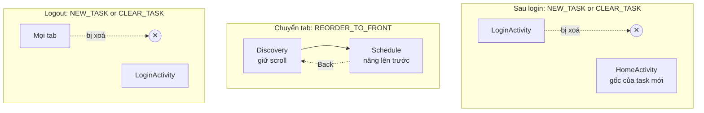
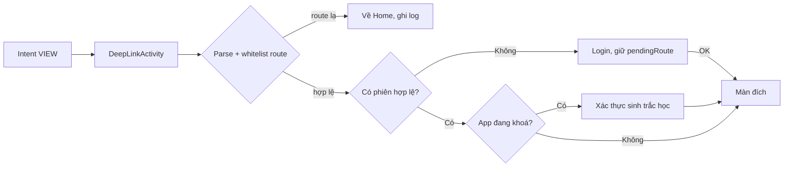
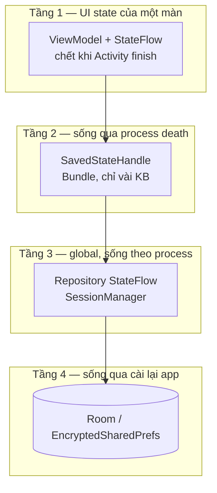

# 07 — AppRouter & quản lý state

> Nền tảng: [../02-android-core/navigation.md](../02-android-core/navigation.md) ·
> [../01-kien-truc/mvvm.md](../01-kien-truc/mvvm.md) ·
> [../05-jetpack/lifecycle-viewmodel.md](../05-jetpack/lifecycle-viewmodel.md).
>
> Trang này gộp hai chủ đề vì trong phỏng vấn chúng luôn đi cùng nhau: *"Em chuyển màn thế nào và
> state sống ở đâu?"*

---

## 1. Bốn cách chuyển màn trên Android

| Cách | Khi nào dùng | Nhược điểm |
|---|---|---|
| `startActivity(Intent)` rải rác | Prototype | Không biết app đi đâu được; mỗi màn phải biết tên màn khác |
| **Router tập trung** (repo này) | Dự án vừa, không dùng Fragment | Tự viết, tự lo back stack |
| **Navigation Component** | Single-Activity + Fragment | Học phí XML nav graph, khó với multi-Activity |
| **Compose Navigation** | App Compose | Không áp dụng ở đây |

Repo này chọn cách 2: **`util/AppRouter.kt` là nơi duy nhất được gọi `startActivity`**.

```kotlin
// Toàn bộ "bản đồ" app nằm trong một file -> đọc 1 file là biết app đi đâu được
object AppRouter {
    private val TABS = mapOf(
        R.id.nav_discovery to DiscoveryActivity::class.java,
        R.id.nav_schedule  to ScheduleActivity::class.java,
        R.id.nav_personal  to PersonalActivity::class.java,
    )

    fun openTab(from: Activity, itemId: Int): Boolean { /* REORDER_TO_FRONT */ }
    fun openHomeAfterLogin(from: Activity) { /* NEW_TASK or CLEAR_TASK + finish() */ }
    fun logout(from: Activity) { /* NEW_TASK or CLEAR_TASK + finish() */ }
    fun openSettings(from: Activity) { /* push thường */ }
}
```

**Vì sao đáng nói trong phỏng vấn:** đây chính là **Coordinator pattern** (rất phổ biến bên iOS)
áp dụng cho Android. Lợi ích cụ thể:

1. Đổi màn đích (A/B test hai màn Home) chỉ sửa một chỗ.
2. Chèn được **cổng kiểm tra** — mọi điều hướng vào vùng đã đăng nhập đều qua router, dễ chèn
   kiểm tra phiên/khoá màn hình.
3. Activity **không phụ thuộc lẫn nhau** → dễ tách module sau này.

### Back stack — bốn cờ Intent phải thuộc

| Cờ | Tác dụng | Dùng khi |
|---|---|---|
| `FLAG_ACTIVITY_NEW_TASK` + `CLEAR_TASK` | Xoá sạch stack, tạo task mới | Sau login, sau logout — **chặn Back quay lại vùng cũ** |
| `FLAG_ACTIVITY_REORDER_TO_FRONT` | Nâng Activity đã có lên trước, **không tạo lại** | Chuyển tab mà giữ nguyên state |
| `FLAG_ACTIVITY_CLEAR_TOP` | Huỷ mọi Activity trên đích | Về Home từ sâu trong luồng |
| `FLAG_ACTIVITY_SINGLE_TOP` | Không tạo mới nếu đang ở đỉnh | Nhận deeplink trùng màn đang mở |



> ⚠️ `REORDER_TO_FRONT` **làm xáo trộn thứ tự stack**, nên Back không còn đoán được. Repo này xử lý
> bằng `onBackPressedDispatcher` đăng ký thủ công: các tab không phải gốc thì Back quay về tab gốc;
> tab gốc thì Back thoát app — đúng hợp đồng Material bottom nav. Đây là chi tiết rất đáng kể,
> vì nó cho thấy bạn hiểu **hệ quả** của cờ chứ không chỉ biết tên cờ.

---

## 2. Deeplink — cổng vào từ notification/widget

```xml
<activity
    android:name=".ui.deeplink.DeepLinkActivity"
    android:exported="true"
    android:launchMode="singleTask">
    <intent-filter android:autoVerify="true">
        <action android:name="android.intent.action.VIEW" />
        <category android:name="android.intent.category.DEFAULT" />
        <category android:name="android.intent.category.BROWSABLE" />
        <!-- App Links (https) đã xác thực, KHÔNG dùng custom scheme cho luồng nhạy cảm -->
        <data android:scheme="https" android:host="m.bank.vn" android:pathPrefix="/app" />
    </intent-filter>
</activity>
```



**Ba quy tắc bảo mật:**

1. **Whitelist** route, không `Class.forName` từ chuỗi trong Intent.
2. **Không tin tham số**: deeplink chỉ mang `txnId`, chi tiết phải gọi API lấy lại.
3. `android:autoVerify="true"` + `assetlinks.json` — dùng App Links thay custom scheme,
   vì `bankapp://` bị app khác đăng ký trùng để cướp.

---

## 3. State sống ở đâu — bốn tầng



| Tình huống | Tầng nào cứu được? |
|---|---|
| Xoay màn hình | ViewModel ✅ |
| Đổi ngôn ngữ / dark mode | ViewModel ✅ (config change) |
| **Process death** (app ở nền, hệ thống thu hồi RAM) | ViewModel ❌ — cần `SavedStateHandle` |
| Người dùng vuốt tắt app | Chỉ đĩa ✅ |
| Chuyển tab (`REORDER_TO_FRONT`) | ViewModel của tab đó vẫn sống ✅ |

> **Câu hỏi bẫy kinh điển:** *"ViewModel có sống sót qua process death không?"* → **Không.** Nó chỉ
> sống qua **configuration change**. Rất nhiều người trả lời sai câu này.
>
> Test bằng: Developer options → **"Don't keep activities"**, hoặc
> `adb shell am kill <package>` khi app ở nền.

```kotlin
class TransferViewModel(
    private val savedStateHandle: SavedStateHandle,
) : ViewModel() {

    // Dữ liệu người dùng đã gõ -> phải sống qua process death
    private val _form = savedStateHandle.getStateFlow(KEY_FORM, TransferForm())

    fun onAmountChanged(value: Long) {
        savedStateHandle[KEY_FORM] = _form.value.copy(amount = value)
    }
}
```

> ⚠️ `SavedStateHandle` ghi vào `Bundle` — giới hạn thực tế khoảng **500KB** cho toàn transaction
> (`TransactionTooLargeException`). Chỉ để **id và input của người dùng**, không để danh sách dữ liệu.

---

## 4. `StateFlow` vs `LiveData` vs `SharedFlow`

| | LiveData | StateFlow | SharedFlow |
|---|---|---|---|
| Có giá trị khởi tạo | Không bắt buộc | **Bắt buộc** | Không |
| Lifecycle-aware sẵn | ✅ | ❌ (cần `repeatOnLifecycle`) | ❌ |
| Toán tử (map/filter/combine) | Nghèo nàn | ✅ Đầy đủ Flow | ✅ |
| Phát lại giá trị cuối | ✅ | ✅ | Cấu hình `replay` |
| Loại bỏ giá trị trùng | Không | ✅ (`distinctUntilChanged` mặc định) | Không |
| Hợp cho | Code Java cũ | **UI state** | **Sự kiện một lần** |

**Quy tắc vàng: state dùng `StateFlow`, sự kiện dùng `Channel`/`SharedFlow`.**

Lý do — đây là câu hỏi hay được hỏi và nhiều người trả lời hời hợt:

```kotlin
// ❌ SAI: nhét thông báo lỗi vào state
data class UiState(val errorMessage: String? = null)
// Xoay màn hình -> StateFlow phát lại giá trị cuối -> toast hiện LẠI. Người dùng bực.

// ✅ ĐÚNG: state là "màn hình đang trông thế nào", event là "vừa xảy ra chuyện gì"
private val _events = Channel<UiEvent>(Channel.BUFFERED)
val events = _events.receiveAsFlow()   // mỗi event được TIÊU THỤ đúng một lần
```

Repo này áp dụng đúng mô hình đó ở `DiscoveryViewModel` / `ScheduleViewModel`:
`uiState: StateFlow<...>` + `events: Flow<DiscoveryEvent>`.

### `repeatOnLifecycle` — vì sao bắt buộc

```kotlin
// ❌ Coroutine vẫn chạy khi app ở background -> tốn pin, cập nhật UI không ai thấy
lifecycleScope.launch { viewModel.uiState.collect(::render) }

// ✅ Dừng ở onStop, chạy lại ở onStart
lifecycleScope.launch {
    repeatOnLifecycle(Lifecycle.State.STARTED) {
        launch { viewModel.uiState.collect(::render) }
        launch { viewModel.events.collect(::handleEvent) }
    }
}
```

`flowWithLifecycle` là bản rút gọn cho **một** flow; nhiều flow thì dùng `repeatOnLifecycle` với
các `launch` con như trên.

---

## 5. Thiết kế UiState: `data class` hay `sealed interface`?

| | `data class` | `sealed interface` |
|---|---|---|
| Khi nào | Các trạng thái **chồng nhau** | Màn hình ở **đúng một** trạng thái |
| Ví dụ | Danh sách + đang refresh + đang lọc cùng lúc | Loading / Success / Error của màn chi tiết |
| Lợi ích | Không bị "mất" dữ liệu cũ khi loading | `when` **exhaustive** — thêm state mới là lỗi biên dịch |

```kotlin
// data class — màn danh sách (repo này: DiscoveryUiState)
data class DiscoveryUiState(
    val isLoading: Boolean = false,
    val isRefreshing: Boolean = false,
    val allItems: List<DiscoveryItem> = emptyList(),
    val selectedCategory: DiscoveryCategory? = null,
    val searchQuery: String = "",
    val errorKind: AppException.Kind? = null,
) {
    // ⭐ State DẪN XUẤT: tính từ nguồn, KHÔNG lưu thành field riêng
    val visibleItems: List<DiscoveryItem>
        get() = allItems
            .filter { selectedCategory == null || it.category == selectedCategory }
            .filter { searchQuery.isBlank() || it.title.contains(searchQuery, ignoreCase = true) }
}

// sealed interface — màn chi tiết
sealed interface DetailUiState {
    data object Loading : DetailUiState
    data class Success(val item: DiscoveryItem) : DetailUiState
    data class Error(val kind: AppException.Kind) : DetailUiState
}
```

> **Vì sao state dẫn xuất quan trọng:** nếu lưu `visibleItems` thành field riêng, bạn phải nhớ cập
> nhật nó ở **mọi** chỗ đổi `allItems`, `searchQuery`, hoặc `selectedCategory`. Quên một chỗ là bug
> "lọc xong danh sách không đổi". Tính bằng `get()` thì **không thể sai**.

---

## 6. So sánh với GetX (nền tảng bạn từng làm)

Đây là câu hỏi bạn gần như chắc chắn bị hỏi: *"Em quen GetX, sang native khác gì?"*

| Khái niệm | GetX (Flutter) | Android native |
|---|---|---|
| Giữ state | `GetxController` + `.obs` (Rx) | `ViewModel` + `StateFlow` |
| Lắng nghe | `Obx(() => ...)` tự động rebuild | `collect` trong `repeatOnLifecycle` |
| Vòng đời | `onInit` / `onClose` | `init { }` / `onCleared()` |
| DI | `Get.put` / `Get.find` (service locator) | Hilt, hoặc `AppContainer` như repo này |
| Điều hướng | `Get.toNamed('/detail')` | `AppRouter` + `Intent` |
| Sự kiện một lần | `Get.snackbar` gọi thẳng trong controller | `Channel` → View xử lý |

**Ba điểm khác biệt phải nói rõ (thể hiện bạn hiểu chứ không chỉ đổi cú pháp):**

1. **GetX cho phép controller gọi thẳng UI** (`Get.snackbar`, `Get.to`). Android native
   **không nên** — ViewModel không được import `android.view`, `Context`. Điều này làm ViewModel
   test được bằng JUnit thuần, không cần Robolectric.
2. **GetX quản lý lifecycle rất lỏng.** `Get.put(permanent: true)` sống mãi. Android có
   `viewModelScope` **tự huỷ** — coroutine bị cancel khi ViewModel chết, không rò rỉ.
3. **Không có process death trong tư duy Flutter.** Android bắt buộc nghĩ tới `SavedStateHandle`.
   Đây là khác biệt lớn nhất khi chuyển từ Flutter sang native, và là điều đáng nói nhất.

> **Cách trả lời hay:** *"GetX tiện vì gộp DI + navigation + state vào một chỗ, hợp để đi nhanh.
> Nhưng nó khiến controller biết quá nhiều về UI. Khi em viết tầng native cho ForgeRock, em buộc
> phải tách hẳn: native chỉ trả dữ liệu và mã lỗi, không quyết định điều hướng. Sang MVVM Android
> em thấy chính là ranh giới đó, chỉ có điều nó được ép buộc bằng kiến trúc chứ không dựa vào kỷ luật."*

---

## 7. Câu hỏi hay bị vặn

**"Vì sao không dùng Navigation Component?"**
Repo này là **multi-Activity, không Fragment**. Navigation Component được thiết kế cho
single-Activity + Fragment; ép dùng cho multi-Activity chỉ còn `ActivityNavigator`, gần như không
lợi gì so với Intent. Nếu chuyển sang single-Activity thì Navigation Component **là lựa chọn đúng**
— nói được điều kiện chuyển đổi tốt hơn là khen/chê một chiều.

**"Truyền dữ liệu giữa các màn thế nào?"**
Chỉ truyền **ID** qua Intent extra, màn đích tự hỏi repository. Không truyền cả object vì:
(1) `Parcelable` lớn dễ `TransactionTooLargeException`, (2) object trong Intent là **bản chụp**,
lệch ngay khi dữ liệu được làm mới. Repo này làm đúng: `DiscoveryDetailActivity.newIntent(context, itemId)`.

**"Hai màn cùng cần một dữ liệu thì sao?"**
Không dùng ViewModel chung giữa hai Activity (không có `activityViewModels` như Fragment). Đúng bài
là để **repository giữ `StateFlow`**, hai ViewModel cùng đọc — đó chính là cấu trúc
`DiscoveryRepository.items` của repo này.

**"Singleton `object AppRouter` có bị rò rỉ bộ nhớ không?"**
Không, **miễn là không giữ tham chiếu `Activity`**. `AppRouter` nhận `Activity` làm **tham số hàm**
chứ không lưu thành field. Giữ `Context` của Activity trong `object` là lỗi `StaticFieldLeak` —
lint của repo này đã bật ở mức `error`.

---

## Từ khoá phải thuộc

`Intent` flags (`NEW_TASK`, `CLEAR_TASK`, `CLEAR_TOP`, `REORDER_TO_FRONT`, `SINGLE_TOP`) ·
`launchMode` (`standard`/`singleTop`/`singleTask`/`singleInstance`) · `onBackPressedDispatcher` ·
`App Links` vs custom scheme · `Coordinator pattern` · `ViewModel` vs `SavedStateHandle` ·
`process death` · `TransactionTooLargeException` · `StateFlow` vs `LiveData` vs `SharedFlow` ·
`Channel` cho one-time event · `repeatOnLifecycle` · `derived state` · `sealed interface` UiState ·
`StaticFieldLeak`
