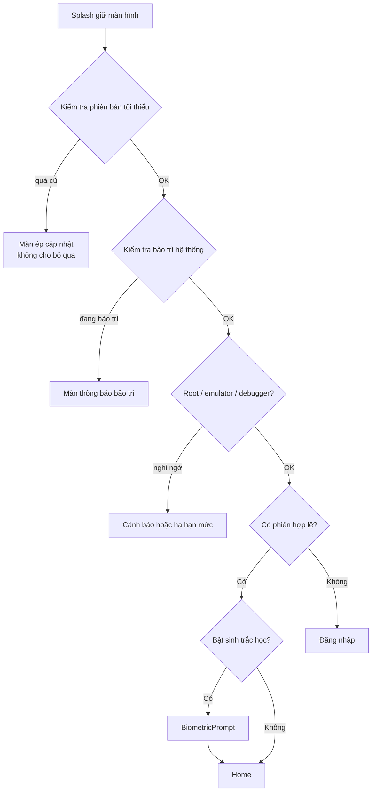
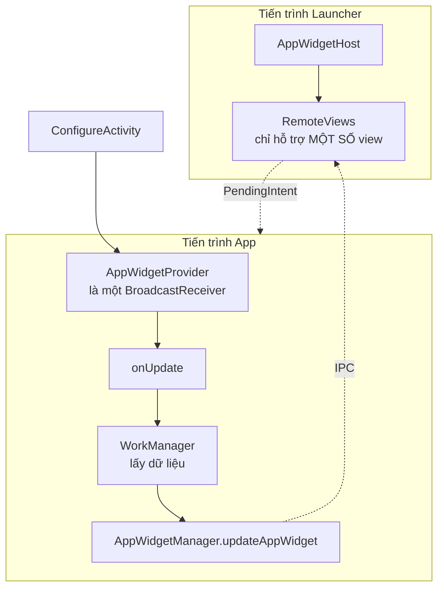

# 08 — Splash Screen & App Widget

> Nền tảng widget: [../04-app-widget/app-widget.md](../04-app-widget/app-widget.md).

---

## 1. Splash Screen — đừng tự vẽ nữa

Từ **Android 12 (API 31)**, hệ thống **luôn** hiển thị splash screen mặc định cho mọi app. Nếu bạn
vẫn giữ một `SplashActivity` tự viết, người dùng sẽ thấy **splash hai lần**: cái của hệ thống rồi
đến cái của bạn. Đây là lỗi thẩm mỹ rất phổ biến sau khi nâng target SDK, và là câu hỏi hay được hỏi.

### Cách đúng: `androidx.core:core-splashscreen`

```xml
<!-- res/values/themes.xml -->
<style name="Theme.App.Starting" parent="Theme.SplashScreen">
    <item name="windowSplashScreenBackground">@color/background_primary</item>
    <item name="windowSplashScreenAnimatedIcon">@drawable/ic_logo</item>
    <item name="windowSplashScreenAnimationDuration">300</item>
    <!-- Theme sẽ được ÁP sau khi splash biến mất -->
    <item name="postSplashScreenTheme">@style/Theme.Application_AI_Assisstant</item>
</style>
```

```xml
<activity
    android:name=".ui.login.LoginActivity"
    android:theme="@style/Theme.App.Starting"
    android:exported="true">
    <intent-filter>
        <action android:name="android.intent.action.MAIN" />
        <category android:name="android.intent.category.LAUNCHER" />
    </intent-filter>
</activity>
```

```kotlin
class LoginActivity : AppCompatActivity() {
    override fun onCreate(savedInstanceState: Bundle?) {
        // ⚠️ PHẢI gọi TRƯỚC super.onCreate()
        val splashScreen = installSplashScreen()
        super.onCreate(savedInstanceState)

        // Giữ splash cho tới khi biết đi đâu: đã đăng nhập -> Home, chưa -> Login
        splashScreen.setKeepOnScreenCondition { !viewModel.isReady.value }

        // Hiệu ứng thoát tuỳ biến
        splashScreen.setOnExitAnimationListener { provider ->
            ObjectAnimator.ofFloat(provider.view, View.ALPHA, 1f, 0f).apply {
                duration = 200
                doOnEnd { provider.remove() }
                start()
            }
        }
    }
}
```

Repo này đã dùng đúng mô hình đó: `Theme.App.Starting` + `installSplashScreen()` trong
`LoginActivity`, không có `SplashActivity` riêng.

### Vì sao KHÔNG nên có `SplashActivity` riêng

| Vấn đề | Giải thích |
|---|---|
| Splash hai lần trên Android 12+ | Hệ thống vẽ trước, Activity của bạn vẽ lại |
| Thêm một lần khởi tạo Activity | Chậm hơn, tốn RAM |
| Deeplink phải đi vòng | `SplashActivity` → parse → forward, dễ mất extra |
| `singleTask` sai là app mở lại từ đầu | Người dùng bấm notification lại thấy splash |

### Splash Screen "đúng nghiệp vụ" cho app ngân hàng

Splash không phải chỉ để đẹp. Trong app banking nó là chỗ chạy các **kiểm tra bắt buộc**:



> ⚠️ **Giới hạn thời gian giữ splash.** `setKeepOnScreenCondition` mà chờ một API không có timeout
> thì splash treo vô hạn — người dùng tưởng app hỏng. Luôn có `withTimeoutOrNull(3_000)` và một
> đường đi tiếp khi hết giờ.

```kotlin
// Trong ViewModel
init {
    viewModelScope.launch {
        val config = withTimeoutOrNull(SPLASH_TIMEOUT_MS) { configRepository.fetch() }
        destination = when {
            config == null -> Destination.Login          // hết giờ: vẫn cho vào
            config.forceUpdate -> Destination.ForceUpdate
            config.maintenance -> Destination.Maintenance
            sessionManager.isLoggedIn -> Destination.Home
            else -> Destination.Login
        }
        _isReady.value = true
    }
}
```

### Tối ưu thời gian khởi động (JD: "tối ưu hiệu năng")

| Kỹ thuật | Ghi chú |
|---|---|
| **App Startup** (`androidx.startup`) | Gộp các `ContentProvider` khởi tạo thư viện thành một |
| Không làm việc nặng trong `Application.onCreate` | Mỗi mili giây ở đây là mỗi mili giây màn hình trắng |
| Lazy init | `by lazy` cho những thứ chưa cần ngay — `AppContainer` của repo này làm đúng thế |
| **Baseline Profile** | Cải thiện 20–30% thời gian khởi động lạnh, không đổi một dòng code nghiệp vụ |
| Đo bằng gì | `adb shell am start -W -n pkg/.Activity` → xem `TotalTime`; hoặc Macrobenchmark |

**Ba loại khởi động phải phân biệt:** *cold start* (process chưa tồn tại), *warm start* (process
còn, Activity bị huỷ), *hot start* (chỉ đưa lên foreground). Người phỏng vấn hỏi "app em khởi động
bao lâu" là đang hỏi **cold start**.

---

## 2. App Widget



### Ba giới hạn phải nắm

1. **`RemoteViews` không phải View thường.** Chỉ hỗ trợ một tập nhỏ: `TextView`, `ImageView`,
   `Button`, `LinearLayout`, `FrameLayout`, `RelativeLayout`, `GridLayout`, `ListView`,
   `ProgressBar`, `Chronometer`. **Không có** `ConstraintLayout`, `RecyclerView`, view tuỳ biến.
2. **`AppWidgetProvider` là `BroadcastReceiver`** → `onUpdate` chỉ có **~10 giây** rồi bị kill.
   Không gọi mạng ở đó. Đúng bài: enqueue `WorkManager` rồi cập nhật sau.
3. **`updatePeriodMillis` tối thiểu 30 phút**, và hệ thống có thể trì hoãn. Cần cập nhật nhanh hơn
   thì phải dùng WorkManager định kỳ (tối thiểu 15 phút) hoặc push từ FCM.

```kotlin
class BalanceWidgetProvider : AppWidgetProvider() {

    override fun onUpdate(context: Context, manager: AppWidgetManager, ids: IntArray) {
        // KHÔNG gọi API ở đây — Receiver bị kill sau ~10s
        ids.forEach { id ->
            // Vẽ ngay dữ liệu cache để widget không trống
            manager.updateAppWidget(id, buildViews(context, cache.lastBalance))
        }
        WidgetUpdateWorker.enqueue(context, ids)
    }

    private fun buildViews(context: Context, balance: Balance?): RemoteViews =
        RemoteViews(context.packageName, R.layout.widget_balance).apply {
            // Ẩn số dư mặc định — widget nằm ở màn hình chính, ai cũng nhìn thấy
            setTextViewText(
                R.id.tv_balance,
                if (prefs.hideBalanceOnWidget) "••••••••" else balance?.formatted.orEmpty(),
            )
            setOnClickPendingIntent(R.id.root, openAppIntent(context))
        }
}
```

> ⚠️ **Rủi ro riêng của widget ngân hàng:** widget hiển thị trên màn hình chính, **không qua bất kỳ
> lớp xác thực nào**. Ai cầm máy cũng thấy. Vì thế: mặc định **che số dư**, chỉ hiện khi người dùng
> chủ động bật; và bấm vào widget phải vào **cổng kiểm tra phiên**, không nhảy thẳng màn giao dịch.
> Đây là một điểm rất tốt để nói — nó cho thấy bạn tư duy bảo mật theo ngữ cảnh sản phẩm.

### Widget tương tác (Android 12+)

```kotlin
// API 31+: RemoteViews hỗ trợ RemoteResponse + thay đổi kích thước theo breakpoint
val sizes = mapOf(
    SizeF(180f, 110f) to compactViews(),
    SizeF(270f, 110f) to detailedViews(),
)
manager.updateAppWidget(id, RemoteViews(sizes))
```

### `PendingIntent` — bẫy API 31

```kotlin
// Từ API 31, KHÔNG khai FLAG_IMMUTABLE hoặc FLAG_MUTABLE -> crash ngay khi tạo
PendingIntent.getActivity(
    context, requestCode, intent,
    PendingIntent.FLAG_UPDATE_CURRENT or PendingIntent.FLAG_IMMUTABLE,
)
```

`FLAG_IMMUTABLE` là mặc định nên chọn: app khác không sửa được Intent bên trong. Chỉ dùng
`FLAG_MUTABLE` khi bắt buộc (ví dụ `RemoteInput` trả lời nhanh trong notification).

### So sánh nhanh với iOS (bạn từng làm cả hai)

| | Android AppWidget | iOS WidgetKit |
|---|---|---|
| Công nghệ | `RemoteViews` (XML) hoặc Glance (Compose) | SwiftUI, bắt buộc |
| Cập nhật | `onUpdate` + WorkManager | `TimelineProvider`, hệ thống quyết định thời điểm |
| Chia sẻ dữ liệu với app | Cùng process, dùng chung DB | **App Group** (`UserDefaults(suiteName:)`) |
| Tương tác | `PendingIntent`, khá tự do | Rất hạn chế (iOS 17 mới có `AppIntent`) |
| Tần suất | ≥ 30 phút | Hệ thống cấp "budget", không đảm bảo |

---

## 3. Câu hỏi hay bị vặn

**"Splash screen nên kéo dài bao lâu?"**
Không nên có "độ dài". Splash chỉ tồn tại đúng bằng thời gian app cần để sẵn sàng. Cố tình
`delay(2000)` để khoe logo là **phản UX** — Google Play còn cảnh báo. Nếu marketing đòi, thoả hiệp:
giữ splash tối đa 1 giây **và chỉ khi** dữ liệu chưa sẵn sàng.

**"Widget cập nhật liên tục có tốn pin không?"**
Có, rất tốn — đó chính là lý do hệ thống ép tối thiểu 30 phút. Chiến lược đúng cho ngân hàng:
widget hiển thị dữ liệu cache + thời điểm cập nhật ("lúc 09:15"), và **FCM đẩy** khi có biến động
thật thay vì widget tự hỏi định kỳ.

**"Widget có chạy khi app bị force-stop không?"**
Không. Force-stop chặn mọi broadcast tới app, widget đóng băng ở lần vẽ cuối. Đây là hành vi hệ
thống, không sửa được — cùng lý do khiến FCM cũng không tới ([xem 03 §6](03-fcm-push.md)).

---

## Từ khoá phải thuộc

`installSplashScreen()` · `Theme.SplashScreen` · `postSplashScreenTheme` ·
`setKeepOnScreenCondition` · `setOnExitAnimationListener` · cold/warm/hot start ·
`androidx.startup` · `Baseline Profile` · `Macrobenchmark` · `AppWidgetProvider` ·
`RemoteViews` (giới hạn view) · `AppWidgetManager.updateAppWidget` · `updatePeriodMillis` ·
`PendingIntent.FLAG_IMMUTABLE` · `WidgetKit` / `TimelineProvider` / `App Group`
