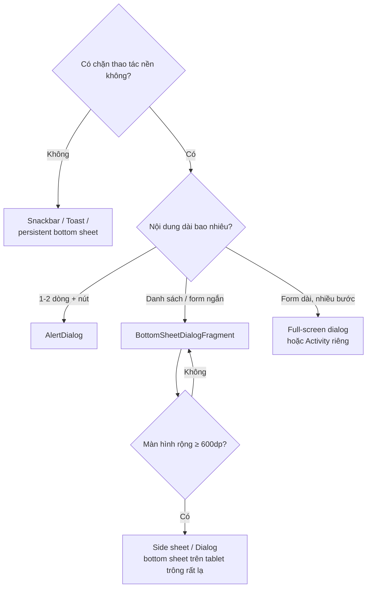

# 09 — Modal · BottomSheet · Popup · Side sheet

JD có gạch đầu dòng *"Hiểu các nguyên tắc cơ bản về thiết kế giao diện và trải nghiệm người dùng
trên thiết bị di động"*. Đây là trang phục vụ đúng gạch đó, kèm các bẫy kỹ thuật.

---

## 1. Bảng chọn loại "lớp phủ"

| Loại | Component Android | Khi nào dùng | Khi nào **không** |
|---|---|---|---|
| **Bottom sheet (modal)** | `BottomSheetDialogFragment` | Chọn tài khoản nguồn, chọn ngân hàng, xác nhận giao dịch | Nội dung dài hơn 1 màn hình |
| **Bottom sheet (persistent)** | `BottomSheetBehavior` trong `CoordinatorLayout` | Bản đồ ATM: danh sách kéo lên từ dưới | Khi cần chặn tương tác nền |
| **Dialog** | `MaterialAlertDialogBuilder` | Xác nhận huỷ lệnh, cảnh báo lỗi | Có form nhập nhiều trường |
| **Full-screen dialog** | `DialogFragment` + `STYLE_NORMAL` fullscreen | Form nhập dài, thêm người thụ hưởng | Chỉ hỏi Yes/No |
| **Popup / dropdown** | `PopupMenu`, `ListPopupWindow`, `MaterialAutoCompleteTextView` | Menu ngữ cảnh, gợi ý ô tìm kiếm | Thao tác quan trọng |
| **Tooltip** | `TooltipCompat`, `Balloon` | Giải thích icon | Thông tin bắt buộc đọc |
| **Snackbar** | `Snackbar` | Thông báo có hành động hoàn tác | Lỗi nghiêm trọng |
| **Toast** | `Toast` | Thông báo phụ, không cần hành động | Android 12+ giới hạn tuỳ biến |
| **Side sheet (phải/trái)** | `DrawerLayout` (trái = navigation) / `SideSheetDialog` (Material 1.11+) | Bộ lọc trên tablet | Trên điện thoại — dùng bottom sheet thay thế |



> **Nguyên tắc Material quan trọng:** trên màn hình rộng (tablet, foldable mở), bottom sheet kéo
> ngang toàn màn hình trông rất tệ. Material 3 khuyến nghị đổi sang **dialog** hoặc **side sheet**
> ở breakpoint ≥ 600dp. Repo này đã có sẵn tư duy responsive với `layout-w936dp` / `layout-w1240dp`
> — nói được mối liên hệ này là điểm cộng.

---

## 2. `BottomSheetDialogFragment` — bản dùng được thật

```kotlin
class SelectAccountBottomSheet : BottomSheetDialogFragment() {

    // ⭐ Kết quả trả về qua ViewModel dùng chung, KHÔNG qua interface callback
    private val viewModel: TransferViewModel by activityViewModels()

    override fun onCreateDialog(savedInstanceState: Bundle?): Dialog =
        super.onCreateDialog(savedInstanceState).apply {
            setOnShowListener { dialog ->
                val sheet = (dialog as BottomSheetDialog)
                    .findViewById<View>(com.google.android.material.R.id.design_bottom_sheet)!!
                BottomSheetBehavior.from(sheet).apply {
                    // Mở là hiện hết, không dừng ở nửa màn
                    state = BottomSheetBehavior.STATE_EXPANDED
                    skipCollapsed = true
                    // Với xác nhận giao dịch: cấm vuốt xuống để đóng nhầm
                    isDraggable = !requireArguments().getBoolean(ARG_MANDATORY)
                }
            }
        }

    override fun onCreateView(i: LayoutInflater, c: ViewGroup?, s: Bundle?): View {
        _binding = SheetSelectAccountBinding.inflate(i, c, false)
        return binding.root
    }

    override fun onDestroyView() {
        super.onDestroyView()
        _binding = null          // ⚠️ bắt buộc — Fragment sống lâu hơn View của nó
    }

    companion object {
        private const val TAG = "SelectAccountBottomSheet"
        private const val ARG_MANDATORY = "mandatory"

        fun show(fm: FragmentManager, mandatory: Boolean = false) {
            // Chống mở trùng khi người dùng bấm nhanh 2 lần
            if (fm.findFragmentByTag(TAG) != null) return
            SelectAccountBottomSheet().apply {
                arguments = bundleOf(ARG_MANDATORY to mandatory)
            }.show(fm, TAG)
        }
    }
}
```

### `isCancelable` vs `isDraggable` vs `isHideable`

| Thuộc tính | Chặn cái gì |
|---|---|
| `isCancelable = false` | Bấm ra ngoài **và** nút Back |
| `isDraggable = false` | Vuốt xuống |
| `isHideable = false` | Trạng thái `STATE_HIDDEN` (cho persistent sheet) |

Muốn **bắt buộc** người dùng chọn (ví dụ nhập OTP): phải set **cả ba**. Chỉ set `isCancelable=false`
thì vẫn vuốt xuống đóng được — đây là bug rất hay gặp.

---

## 3. Mười bẫy thường gặp

| # | Bẫy | Triệu chứng | Cách xử lý |
|---|---|---|---|
| 1 | Bàn phím che ô nhập trong bottom sheet | Không thấy đang gõ gì | `android:windowSoftInputMode="adjustResize"` + `EdgeToEdge`; API 30+ dùng `WindowInsetsCompat.Type.ime()` |
| 2 | `show()` sau `onSaveInstanceState` | `IllegalStateException: Can not perform this action after onSaveInstanceState` | Dùng `lifecycleScope` + `repeatOnLifecycle(STARTED)`, hoặc `commitAllowingStateLoss` (giải pháp cuối) |
| 3 | Mở trùng khi bấm nhanh 2 lần | Hai sheet chồng nhau | `findFragmentByTag` trước khi `show` (xem code trên) |
| 4 | Rò rỉ `binding` | `View` bị giữ sau `onDestroyView` | Gán `_binding = null` trong `onDestroyView` |
| 5 | Callback qua `setTargetFragment` | Deprecated, mất sau khi tái tạo | Dùng `activityViewModels()` hoặc **Fragment Result API** |
| 6 | Xoay máy làm mất dữ liệu đã chọn | Sheet mở lại trống | Giữ trạng thái trong ViewModel, không trong biến của Fragment |
| 7 | Sheet cao quá màn hình | Nội dung dưới bị cắt | Bọc `NestedScrollView`, **không** `ScrollView` (mất phối hợp cuộn) |
| 8 | Dialog dùng `Activity` context trong `object`/singleton | `WindowLeaked` khi Activity chết | Luôn tạo dialog từ context của màn đang sống |
| 9 | Không xử lý nút Back của hệ thống | Đóng luôn cả màn nền | `onBackPressedDispatcher` với `isEnabled` theo trạng thái sheet |
| 10 | Edge-to-edge (API 35 bắt buộc) làm sheet chui xuống nav bar | Nút bị che | `ViewCompat.setOnApplyWindowInsetsListener` + padding bottom |

```kotlin
// Bẫy #1 và #10 — xử lý insets cho bottom sheet
ViewCompat.setOnApplyWindowInsetsListener(binding.root) { view, insets ->
    val ime = insets.getInsets(WindowInsetsCompat.Type.ime())
    val navBar = insets.getInsets(WindowInsetsCompat.Type.navigationBars())
    view.updatePadding(bottom = maxOf(ime.bottom, navBar.bottom))
    insets
}
```

> ⚠️ **Android 15 (API 35) ép edge-to-edge cho mọi app** target 35+. Không xử lý insets thì nội dung
> chui xuống dưới thanh điều hướng. Đây là chủ đề rất "nóng" trong phỏng vấn Android 2025–2026.

---

## 4. Trả kết quả từ sheet về màn cha

**Ba cách, xếp từ tệ tới tốt:**

```kotlin
// ❌ 1. Interface callback + setTargetFragment — deprecated, chết sau process death
// ❌ 2. Ép kiểu parentFragment/activity thành listener — crash khi tái tạo

// ✅ 3a. Fragment Result API — khi hai bên không dùng chung ViewModel
parentFragmentManager.setFragmentResult(
    KEY_ACCOUNT, bundleOf(KEY_ACCOUNT_ID to selected.id)
)
// phía cha:
supportFragmentManager.setFragmentResultListener(KEY_ACCOUNT, this) { _, bundle ->
    viewModel.onAccountSelected(bundle.getString(KEY_ACCOUNT_ID)!!)
}

// ✅ 3b. ViewModel dùng chung — sạch nhất khi cùng một Activity
private val viewModel: TransferViewModel by activityViewModels()
// trong sheet: viewModel.onAccountSelected(id); dismiss()
```

> Repo này **tránh Fragment gần như hoàn toàn** (chỉ `SettingsActivity` dùng
> `PreferenceFragmentCompat`). Nếu người phỏng vấn hỏi "sao lại tránh Fragment", trả lời trung thực:
> *"Đó là quyết định của dự án đó để đơn giản back stack. Nhưng bottom sheet thì gần như bắt buộc
> phải là `DialogFragment` — nếu không sẽ mất state khi xoay máy. Nên em vẫn phải nắm vòng đời
> Fragment."* Trả lời kiểu này thể hiện bạn hiểu **đánh đổi**, không giáo điều.

---

## 5. Nguyên tắc UX cho lớp phủ trong app ngân hàng

| Nguyên tắc | Lý do |
|---|---|
| **Xác nhận giao dịch phải chặn được thao tác nhầm** | `isCancelable=false` + `isDraggable=false`; nút "Xác nhận" nằm bên phải, "Huỷ" bên trái |
| **Hiện lại đầy đủ thông tin trước khi xác nhận** | Số tiền, người nhận, phí — người dùng phải đọc được toàn bộ mà không cuộn |
| **Không tự đóng khi đang gọi API** | Hiện loading trong sheet, khoá nút, tránh double-submit |
| **Chỉ một lớp phủ tại một thời điểm** | Dialog chồng dialog là dấu hiệu điều phối sai |
| **Nút chính đủ lớn** | Tối thiểu 48×48dp theo Material |
| **Accessibility** | `contentDescription`, `announceForAccessibility` khi sheet mở; TalkBack phải đọc được |
| **Không hiện OTP/số dư trong Toast** | Toast hiện cả khi app vào nền trên một số phiên bản |

### Chống double-submit — quan trọng với giao dịch

```kotlin
private fun render(state: ConfirmUiState) = with(binding) {
    btnConfirm.isEnabled = !state.isSubmitting
    progressBar.isVisible = state.isSubmitting
    isCancelable = !state.isSubmitting        // đang gửi tiền thì không cho đóng
}
```

Kết hợp với **`Idempotency-Key`** ở [trang 05 §4](05-api-bao-mat.md): khoá UI là lớp phòng thủ thứ
nhất, idempotency key là lớp thứ hai. Nói được **hai lớp** thay vì một là khác biệt giữa junior và
senior.

---

## 6. Animation cho lớp phủ

| Hướng vào | Cách làm |
|---|---|
| Từ dưới lên (bottom sheet) | Mặc định của `BottomSheetDialog` |
| Từ trên xuống (top sheet) | Không có component sẵn — dùng `DialogFragment` + `windowAnimationStyle` tuỳ biến |
| Từ phải (side sheet) | `SideSheetDialog` (Material 1.11+) hoặc `DrawerLayout` với `layout_gravity="end"` |
| Từ trái | `DrawerLayout` mặc định (navigation drawer) |

```xml
<!-- Top sheet tự chế: theme cho DialogFragment -->
<style name="Dialog.TopSheet" parent="Theme.MaterialComponents.Dialog">
    <item name="android:windowAnimationStyle">@style/Animation.TopSheet</item>
    <item name="android:windowIsFloating">false</item>
    <item name="android:gravity">top</item>
</style>

<style name="Animation.TopSheet" parent="@android:style/Animation">
    <item name="android:windowEnterAnimation">@anim/slide_in_top</item>
    <item name="android:windowExitAnimation">@anim/slide_out_top</item>
</style>
```

> **Material không có "top sheet" chính thức** — nó không nằm trong spec. Nếu thiết kế đòi, phải tự
> dựng và nói rõ với UI/UX rằng nó lệch chuẩn (dễ nhầm với notification kéo xuống của hệ thống).
> Biết **phản biện thiết kế có căn cứ** là kỹ năng JD nhắc tới ở gạch "phối hợp với UI/UX".

---

## Từ khoá phải thuộc

`BottomSheetDialogFragment` · `BottomSheetBehavior` (`STATE_EXPANDED`/`COLLAPSED`/`HIDDEN`) ·
`skipCollapsed` · `isDraggable` vs `isCancelable` vs `isHideable` · `MaterialAlertDialogBuilder` ·
`DialogFragment` lifecycle · `Fragment Result API` · `activityViewModels` ·
`IllegalStateException after onSaveInstanceState` · `WindowLeaked` · `WindowInsetsCompat.Type.ime()` ·
edge-to-edge API 35 · `NestedScrollView` · `SideSheetDialog` · `DrawerLayout` ·
double-submit prevention · 48dp touch target · TalkBack
