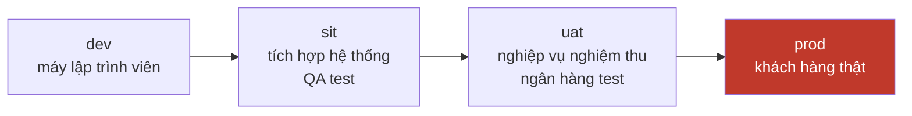
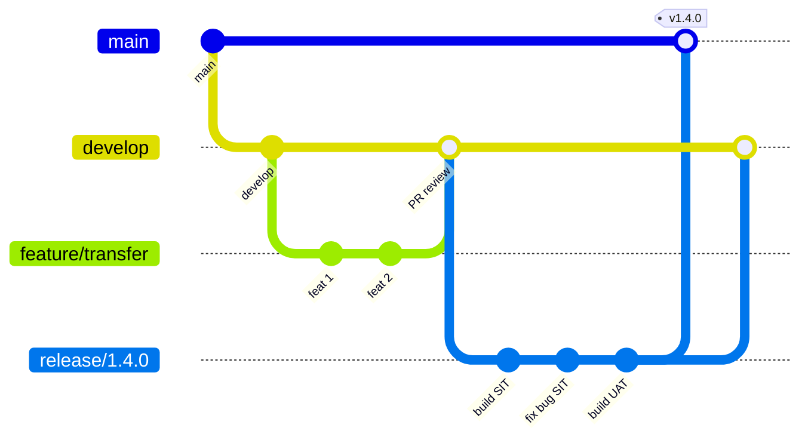
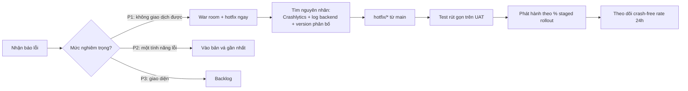

# 10 — Flavor, build automation & quy trình SIT/UAT/PROD

JD có gạch *"Hỗ trợ triển khai, kiểm tra và xử lý các vấn đề phát sinh trong quá trình SIT, UAT và
Production"*. Đây là phần bạn đã làm thật (3 flavor + Makefile), rất đáng khai thác.

---

## 1. Ba môi trường, ba flavor



| Môi trường | Ai dùng | Dữ liệu | Cài song song với prod? |
|---|---|---|---|
| `dev` | Lập trình viên | Giả lập / mock | Có |
| `sit` | QA, BE, FE cùng test tích hợp | Dữ liệu test | Có |
| `uat` | Bộ phận nghiệp vụ ngân hàng | Gần giống thật | Có |
| `prod` | Khách hàng | Thật | — |

**Điểm mấu chốt:** phải cài được **nhiều bản cùng lúc trên một máy** → mỗi flavor một
`applicationIdSuffix`. Không có nó, tester phải gỡ bản này cài bản kia, rất mất thời gian và dễ
nhầm lẫn "bug này ở môi trường nào".

---

## 2. Cấu hình Gradle

```kotlin
// app/build.gradle.kts
android {
    flavorDimensions += "environment"

    productFlavors {
        create("dev") {
            dimension = "environment"
            applicationIdSuffix = ".dev"
            versionNameSuffix = "-dev"
            resValue("string", "app_name", "Bank DEV")
            buildConfigField("String", "BASE_URL", "\"https://api-dev.bank.vn/\"")
            buildConfigField("String", "WS_URL", "\"wss://ws-dev.bank.vn/\"")
            buildConfigField("boolean", "ALLOW_SCREENSHOT", "true")
        }
        create("sit") {
            dimension = "environment"
            applicationIdSuffix = ".sit"
            versionNameSuffix = "-sit"
            resValue("string", "app_name", "Bank SIT")
            buildConfigField("String", "BASE_URL", "\"https://api-sit.bank.vn/\"")
            buildConfigField("String", "WS_URL", "\"wss://ws-sit.bank.vn/\"")
            buildConfigField("boolean", "ALLOW_SCREENSHOT", "true")
        }
        create("uat") {
            dimension = "environment"
            applicationIdSuffix = ".uat"
            versionNameSuffix = "-uat"
            resValue("string", "app_name", "Bank UAT")
            buildConfigField("String", "BASE_URL", "\"https://api-uat.bank.vn/\"")
            buildConfigField("String", "WS_URL", "\"wss://ws-uat.bank.vn/\"")
            buildConfigField("boolean", "ALLOW_SCREENSHOT", "false")
        }
        create("prod") {
            dimension = "environment"
            // KHÔNG có suffix -> applicationId gốc
            resValue("string", "app_name", "Bank")
            buildConfigField("String", "BASE_URL", "\"https://api.bank.vn/\"")
            buildConfigField("String", "WS_URL", "\"wss://ws.bank.vn/\"")
            buildConfigField("boolean", "ALLOW_SCREENSHOT", "false")
        }
    }

    signingConfigs {
        create("release") {
            // Bí mật KHÔNG nằm trong git — đọc từ local.properties hoặc biến môi trường CI
            val props = Properties().apply {
                rootProject.file("keystore.properties")
                    .takeIf { it.exists() }?.inputStream()?.use { load(it) }
            }
            storeFile = file(props.getProperty("storeFile") ?: System.getenv("KEYSTORE_PATH") ?: "debug.keystore")
            storePassword = props.getProperty("storePassword") ?: System.getenv("KEYSTORE_PASSWORD")
            keyAlias = props.getProperty("keyAlias") ?: System.getenv("KEY_ALIAS")
            keyPassword = props.getProperty("keyPassword") ?: System.getenv("KEY_PASSWORD")
        }
    }
}
```

Cấu trúc thư mục tương ứng — mỗi flavor có tài nguyên riêng:

```
app/src/
├── main/                          dùng chung
├── dev/
│   ├── google-services.json       ⭐ MỖI flavor MỘT file, package name phải khớp
│   └── res/mipmap-*/ic_launcher   icon có badge "DEV"
├── sit/
│   ├── google-services.json
│   └── res/
├── uat/
│   └── google-services.json
└── prod/
    ├── google-services.json
    └── res/xml/network_security_config.xml    chỉ prod mới pin chứng chỉ
```

> ⚠️ **Bẫy `google-services.json` là lỗi số 1 khi làm nhiều flavor.** File này chứa
> `package_name`. Nếu `applicationId` là `vn.bank.mobile.sit` mà file khai `vn.bank.mobile`, plugin
> Google Services **fail lúc build** với thông báo khó hiểu, hoặc tệ hơn: build được nhưng FCM
> không bao giờ nhận được message. Cách chắc chắn: một file cho mỗi thư mục flavor, hoặc một file
> duy nhất có **đủ mọi `client` entry** trong Firebase project.

### `gradle.properties` — cấu hình build

```properties
# gradle.properties (commit vào git — KHÔNG chứa bí mật)
org.gradle.jvmargs=-Xmx4096m -XX:MaxMetaspaceSize=1024m
org.gradle.parallel=true
org.gradle.caching=true
org.gradle.configuration-cache=true
android.useAndroidX=true
android.nonTransitiveRClass=true
```

```properties
# local.properties (.gitignore — chứa bí mật, KHÔNG commit)
sdk.dir=/Users/me/Library/Android/sdk
MAPS_API_KEY=AIza...
```

> **Câu hỏi hay:** *"Secret để đâu?"* → Ba mức: (1) **không phải secret thật** (base URL, client id)
> → `buildConfigField`; (2) **secret build-time** (keystore password, API key của bên thứ ba) →
> biến môi trường CI + `local.properties` cho máy cá nhân; (3) **secret thật sự** (khoá ký giao dịch)
> → **không bao giờ đưa vào app**, để backend giữ. Trả lời được cả ba mức là rất khác biệt.

---

## 3. Phía iOS — đối chiếu (bạn từng làm cả hai)

| Android | iOS tương đương |
|---|---|
| Product flavor | **Scheme** + **Configuration** (`Debug-SIT`, `Release-UAT`…) |
| `buildConfigField` | **xcconfig** file (`SIT.xcconfig`) + đọc từ `Info.plist` |
| `applicationIdSuffix` | `PRODUCT_BUNDLE_IDENTIFIER` theo configuration |
| `google-services.json` | `GoogleService-Info.plist` — chọn file trong **Run Script Phase** |
| `resValue app_name` | `CFBundleDisplayName` trong `Info.plist` |
| Gradle dependency | **Podfile** (CocoaPods) hoặc SPM |
| `signingConfigs` | Provisioning profile + certificate trong Keychain |

```ruby
# Podfile — cấu hình cho nhiều configuration
project 'Runner', {
  'Debug-SIT'   => :debug,
  'Release-SIT' => :release,
  'Debug-UAT'   => :debug,
  'Release-UAT' => :release,
  'Debug'       => :debug,
  'Release'     => :release,
}

target 'Runner' do
  use_frameworks!
  pod 'FRAuth', '~> 4.5'
  pod 'FRCore'
end
```

```bash
# Run Script Phase: chọn đúng GoogleService-Info.plist theo configuration
case "${CONFIGURATION}" in
  *SIT* ) ENV_DIR="SIT" ;;
  *UAT* ) ENV_DIR="UAT" ;;
  *     ) ENV_DIR="PROD" ;;
esac
cp -f "${SRCROOT}/config/${ENV_DIR}/GoogleService-Info.plist" \
      "${BUILT_PRODUCTS_DIR}/${PRODUCT_NAME}.app/GoogleService-Info.plist"
```

> **Điểm khó nhất khi làm cả hai nền tảng:** Android tạo **tích Descartes** flavor × buildType
> (`sitDebug`, `sitRelease`, `uatDebug`…) hoàn toàn tự động. iOS thì phải **tự tạo tay từng
> configuration** trong Xcode, và mỗi pod cũng phải khai lại. Quên một configuration là CocoaPods
> báo lỗi rất mơ hồ (`Unable to find a specification`). Đây là câu chuyện thực tế tốt để kể.

---

## 4. Makefile automation

Vì sao dùng Makefile khi đã có Gradle/fastlane: **một câu lệnh giống nhau cho cả hai nền tảng**, và
người mới vào dự án không phải nhớ cú pháp Gradle lẫn xcodebuild.

```makefile
.PHONY: help
help:                    ## Hiện danh sách lệnh
	@grep -E '^[a-zA-Z_-]+:.*?## .*$$' $(MAKEFILE_LIST) | \
	 awk 'BEGIN {FS = ":.*?## "}; {printf "  \033[36m%-22s\033[0m %s\n", $$1, $$2}'

# ---------- Android ----------
run-sit:                 ## Chạy app môi trường SIT
	flutter run --flavor sit -t lib/main_sit.dart

apk-sit:                 ## Build APK SIT
	cd android && ./gradlew assembleSitRelease

aab-prod:                ## Build AAB production để lên Play Console
	cd android && ./gradlew bundleProdRelease

# ---------- iOS ----------
ios-sit:                 ## Build IPA SIT
	flutter build ipa --flavor sit -t lib/main_sit.dart \
	  --export-options-plist=ios/ExportOptions-SIT.plist

pods:                    ## Cài lại pod sạch
	cd ios && rm -rf Pods Podfile.lock && pod install --repo-update

# ---------- Chất lượng ----------
analyze:                 ## Phân tích tĩnh
	flutter analyze
	cd android && ./gradlew lint

test:                    ## Chạy test
	flutter test
	cd android && ./gradlew testSitDebugUnitTest

clean-all:               ## Dọn sạch mọi thứ
	flutter clean
	cd android && ./gradlew clean
	cd ios && rm -rf Pods Podfile.lock build

# ---------- Phát hành ----------
release-sit: clean-all pods apk-sit ios-sit   ## Build cả hai nền tảng cho SIT
	@echo "✅ Xong. Artifact nằm ở build/"
```

> ⚠️ Makefile dùng **tab**, không dùng space, để thụt đầu dòng lệnh. Và trên Windows cần Git Bash /
> WSL — đúng như cảnh báo trong [CLAUDE.md](../../CLAUDE.md) của repo này: `make format` gọi
> `./gradlew ktlintFormat` nhưng plugin ktlint chưa được áp dụng, nên task đó **không tồn tại**.
> Đây là ví dụ tốt về "automation phải được kiểm chứng, không chỉ được viết ra".

---

## 5. Git flow & quy trình SIT/UAT/Production



| Nhánh | Build ra môi trường | Ai duyệt |
|---|---|---|
| `feature/*` | dev | Tự test |
| `develop` | **SIT** tự động mỗi đêm | QA |
| `release/x.y.z` | **UAT** | Nghiệp vụ ngân hàng |
| `main` (có tag) | **Production** | Trưởng dự án + tuân thủ |
| `hotfix/*` | tách từ `main` | Quy trình rút gọn |

**Về code review** (JD có nhắc "tham gia review code"), những gì cần nói:

- PR nhỏ, một mục đích. PR 2000 dòng thì không ai review thật cả.
- Checklist riêng cho banking: có log dữ liệu nhạy cảm không? có hardcode URL/secret không? có xử
  lý lỗi mạng không? có `FLAG_SECURE` ở màn nhạy cảm không?
- Comment vào **hành vi**, không vào người: *"chỗ này 401 sẽ lặp vô hạn"* thay vì *"viết sai rồi"*.

### Xử lý sự cố Production



**Ba con số phải nhớ khi nói về production:**

- **Crash-free users** — app ngân hàng cần ≥ 99.5%; dưới 99% là báo động.
- **Staged rollout** — Play Console phát hành 5% → 20% → 50% → 100%, có thể **halt** giữa chừng.
- **Remote config / feature flag** — tắt được tính năng lỗi mà **không cần phát hành bản mới**.
  Đây là điểm cực kỳ đáng nói: *"Mọi tính năng mới của em đều bọc trong feature flag, để nếu có sự
  cố thì tắt trong 5 phút thay vì chờ 2 ngày duyệt store."*

---

## 6. CI/CD tối thiểu

```yaml
# .github/workflows/android.yml
name: Android CI
on:
  pull_request:
    branches: [develop, main]

jobs:
  build:
    runs-on: ubuntu-latest
    steps:
      - uses: actions/checkout@v4
      - uses: actions/setup-java@v4
        with: { distribution: temurin, java-version: '21' }
      - uses: gradle/actions/setup-gradle@v3

      - run: ./gradlew lintSitDebug
      - run: ./gradlew testSitDebugUnitTest
      - run: ./gradlew assembleSitDebug

      - uses: actions/upload-artifact@v4
        with:
          name: app-sit-debug
          path: app/build/outputs/apk/sit/debug/*.apk
```

Ba thứ CI phải chặn merge: **lint fail**, **unit test fail**, **build fail**. Repo này đã cấu hình
lint mức `error` cho `HardcodedText`, `MissingPermission`, `StaticFieldLeak`, `HandlerLeak` — đúng
tinh thần đó.

---

## Từ khoá phải thuộc

`productFlavors` / `flavorDimensions` · `applicationIdSuffix` · `buildConfigField` / `resValue` ·
`signingConfigs` · `local.properties` vs `gradle.properties` · `google-services.json` per flavor ·
`sourceSets` theo flavor · `xcconfig` · Xcode **scheme** vs **configuration** · `Podfile` ·
`GoogleService-Info.plist` · Run Script Phase · `Makefile` (tab!) · `fastlane` ·
Git flow (`develop` / `release/*` / `hotfix/*`) · SIT / UAT / PROD · **staged rollout** ·
**feature flag** / Remote Config · **crash-free rate** · Crashlytics
