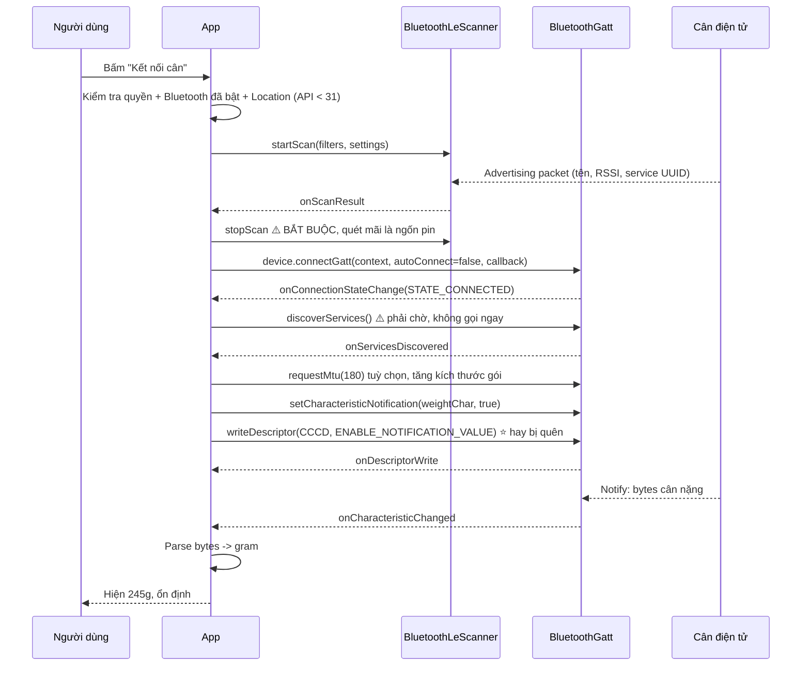

# 13 — Bluetooth: kết nối cân điện tử (dự án Eatsy)

> Nền tảng: [../07-tich-hop/bluetooth.md](../07-tich-hop/bluetooth.md).
> Trang này là **câu chuyện dự án Eatsy**: app đọc cân nặng thực phẩm từ cân Bluetooth ngoài.

Đây là dự án rất tốt để kể trong phỏng vấn banking, dù nó không phải fintech. Lý do: nó chứng minh
bạn làm được **tích hợp thiết bị/SDK bên thứ ba**, xử lý **luồng bất đồng bộ khó lường**, và
**quyền runtime phức tạp** — đúng những kỹ năng cần cho tích hợp thiết bị ký số / soft token / NFC
thẻ trong ngân hàng.

---

## 1. Classic Bluetooth vs BLE — chọn đúng

| | Bluetooth Classic (SPP) | **BLE (Low Energy)** |
|---|---|---|
| Mô hình | Luồng dữ liệu như socket | **GATT**: Service → Characteristic |
| Ghép đôi | Bắt buộc pairing | Thường không cần |
| Tốn pin | Cao | Rất thấp |
| Thiết bị | Máy in, loa, tai nghe | **Cân, vòng đeo, cảm biến, máy đo huyết áp** |
| API Android | `BluetoothSocket` | `BluetoothGatt`, `BluetoothLeScanner` |

**Cân điện tử gần như luôn là BLE.** Nhiều cân dùng luôn chuẩn **Weight Scale Service** của
Bluetooth SIG (`0x181D`), characteristic `Weight Measurement` (`0x2A9D`) — nhưng **rất nhiều hãng
Trung Quốc dùng service tuỳ biến không theo chuẩn**, và đó chính là chỗ khó nhất của dự án.

---

## 2. Luồng kết nối BLE đầy đủ



> ⚠️ **Bẫy lớn nhất: bật notification cần HAI bước.**
> `setCharacteristicNotification(char, true)` chỉ bật ở phía **Android**. Phải ghi thêm vào
> **descriptor CCCD** (`00002902-0000-1000-8000-00805f9b34fb`) mới báo cho **thiết bị** biết mà gửi.
> Thiếu bước hai: kết nối thành công, không lỗi gì, nhưng **không bao giờ nhận được dữ liệu**.
> Đây là câu chuyện debug rất hay để kể — mất nhiều giờ vì không có lỗi nào cả.

```kotlin
private fun enableNotifications(gatt: BluetoothGatt, characteristic: BluetoothGattCharacteristic) {
    // Bước 1: bật ở phía Android
    gatt.setCharacteristicNotification(characteristic, true)

    // Bước 2: báo cho thiết bị qua descriptor CCCD
    val cccd = characteristic.getDescriptor(CCCD_UUID) ?: run {
        Log.e(TAG, "Characteristic không có CCCD — thiết bị không hỗ trợ notify")
        return
    }
    if (Build.VERSION.SDK_INT >= Build.VERSION_CODES.TIRAMISU) {
        gatt.writeDescriptor(cccd, BluetoothGattDescriptor.ENABLE_NOTIFICATION_VALUE)
    } else {
        @Suppress("DEPRECATION")
        cccd.value = BluetoothGattDescriptor.ENABLE_NOTIFICATION_VALUE
        @Suppress("DEPRECATION")
        gatt.writeDescriptor(cccd)
    }
}
```

---

## 3. Hàng đợi thao tác GATT — bài học đắt giá nhất

**Vấn đề:** BLE trên Android **chỉ cho phép MỘT thao tác GATT tại một thời điểm**. Gọi
`writeCharacteristic` khi `readCharacteristic` trước đó chưa có callback → thao tác thứ hai
**bị bỏ im lặng**, trả về `false` mà nhiều người không kiểm tra.

```kotlin
// ❌ SAI — chỉ thao tác đầu tiên chạy
gatt.readCharacteristic(charA)
gatt.readCharacteristic(charB)
gatt.writeDescriptor(cccd)

// ✅ ĐÚNG — xếp hàng, thao tác kế tiếp chỉ chạy khi callback trước trả về
class GattQueue(private val gatt: BluetoothGatt) {
    private val queue = ArrayDeque<GattOperation>()
    private var pending: GattOperation? = null

    @Synchronized fun enqueue(op: GattOperation) {
        queue.addLast(op)
        if (pending == null) executeNext()
    }

    @Synchronized fun onOperationComplete() {
        pending = null
        executeNext()
    }

    private fun executeNext() {
        pending = queue.removeFirstOrNull() ?: return
        val started = pending!!.execute(gatt)
        if (!started) {                       // ⚠️ luôn kiểm tra giá trị trả về
            Log.w(TAG, "Thao tác GATT không khởi động được, bỏ qua")
            onOperationComplete()
        }
        // Có timeout: một số thiết bị không bao giờ gọi callback
        timeoutJob = scope.launch { delay(GATT_TIMEOUT_MS); onOperationComplete() }
    }
}
```

> **Kể trong phỏng vấn:** *"Em từng mất hai ngày vì app đọc được dữ liệu trên máy Samsung nhưng
> không đọc được trên Xiaomi. Hoá ra là do em gọi liên tiếp nhiều thao tác GATT — Samsung có
> buffer rộng hơn nên tình cờ chạy được, còn Xiaomi thì rớt. Sau đó em viết một hàng đợi có
> timeout, và từ đó chạy ổn định trên mọi máy. Bài học: API bất đồng bộ mà không có hàng đợi thì
> lỗi phụ thuộc vào thiết bị, rất khó tái hiện."*

---

## 4. Quyền — thay đổi lớn ở Android 12

| Android | Quyền cần cho quét BLE |
|---|---|
| ≤ 11 (API 30) | `BLUETOOTH`, `BLUETOOTH_ADMIN` + **`ACCESS_FINE_LOCATION`** (và GPS phải **bật**) |
| ≥ 12 (API 31) | `BLUETOOTH_SCAN`, `BLUETOOTH_CONNECT` — **không** cần location nếu khai `neverForLocation` |

```xml
<!-- Android ≤ 11 -->
<uses-permission android:name="android.permission.BLUETOOTH" android:maxSdkVersion="30" />
<uses-permission android:name="android.permission.BLUETOOTH_ADMIN" android:maxSdkVersion="30" />
<uses-permission android:name="android.permission.ACCESS_FINE_LOCATION" android:maxSdkVersion="30" />

<!-- Android 12+ -->
<uses-permission android:name="android.permission.BLUETOOTH_SCAN"
    android:usesPermissionFlags="neverForLocation" />
<uses-permission android:name="android.permission.BLUETOOTH_CONNECT" />
```

> ⚠️ **Vì sao quét BLE lại cần quyền vị trí?** Vì beacon BLE cho phép suy ra vị trí người dùng.
> Google coi đó là dữ liệu vị trí. Đây là câu hỏi phỏng vấn khá hay — trả lời được cho thấy bạn
> hiểu **lý do** chứ không chỉ copy manifest.
>
> Cờ `neverForLocation` là cam kết với hệ thống rằng bạn không dùng BLE để định vị. Khai sai thì
> Play Console từ chối bản phát hành.

```kotlin
// Xin quyền theo phiên bản — repo NativeKotlin hiện CHƯA có chỗ nào làm việc này
private val permissions = if (Build.VERSION.SDK_INT >= Build.VERSION_CODES.S) {
    arrayOf(Manifest.permission.BLUETOOTH_SCAN, Manifest.permission.BLUETOOTH_CONNECT)
} else {
    arrayOf(Manifest.permission.ACCESS_FINE_LOCATION)
}

private val launcher = registerForActivityResult(
    ActivityResultContracts.RequestMultiplePermissions()
) { result ->
    if (result.all { it.value }) startScan()
    else showRationaleOrSettings()      // bị từ chối 2 lần -> phải hướng dẫn vào Cài đặt
}
```

---

## 5. Parse dữ liệu cân — phần "bẩn" nhất

Cân trả về mảng byte. Không có tài liệu, hoặc tài liệu tiếng Trung sai. Cách làm thực tế:

```kotlin
// Ví dụ định dạng phổ biến: [header, flags, weightLow, weightHigh, unit, checksum]
fun parseWeight(bytes: ByteArray): WeightReading? {
    if (bytes.size < 6) return null
    if (bytes[0] != HEADER) return null

    // ⚠️ BLE dùng LITTLE-ENDIAN. Đảo byte là sai số 256 lần — bug kinh điển.
    val raw = (bytes[3].toInt() and 0xFF shl 8) or (bytes[2].toInt() and 0xFF)

    val flags = bytes[1].toInt()
    val isStable = flags and 0x01 != 0        // cân đã ổn định chưa
    val isNegative = flags and 0x02 != 0      // trừ bì (tare)

    val unit = when (bytes[4].toInt()) {
        0 -> WeightUnit.GRAM
        1 -> WeightUnit.OUNCE
        2 -> WeightUnit.MILLILITER
        else -> return null
    }

    // Kiểm tra checksum -> bỏ gói nhiễu, đừng hiển thị số rác
    val checksum = bytes.dropLast(1).fold(0) { acc, b -> acc xor b.toInt() }
    if (checksum.toByte() != bytes.last()) return null

    val grams = if (isNegative) -raw else raw
    return WeightReading(grams, unit, isStable)
}
```

**Ba mẹo reverse-engineering khi không có tài liệu:**

1. **nRF Connect** (app của Nordic) — quét, liệt kê service/characteristic, bật notify và xem
   byte thô. Đây là công cụ số một.
2. Đặt vật có khối lượng **đã biết** (100g, 200g, 500g) lên cân, ghi lại byte, tìm quy luật.
   Thấy `0x64` = 100 là biết ngay đơn vị gram.
3. **`btsnoop_hci` log** — bật trong Developer options, mở bằng Wireshark để xem toàn bộ gói.
   Hữu ích khi so sánh với app gốc của nhà sản xuất.

> ⚠️ **Little-endian**: BLE luôn little-endian. Nếu đọc `0x01F4` mà lại ghép thành `0xF401` thì
> 500g thành 62465g. Lỗi này nhìn kết quả là biết ngay, nhưng tốn thời gian nếu chưa biết quy ước.

---

## 6. Reconnect & lifecycle

```kotlin
override fun onConnectionStateChange(gatt: BluetoothGatt, status: Int, newState: Int) {
    when {
        newState == BluetoothProfile.STATE_CONNECTED -> {
            reconnectAttempts = 0
            gatt.discoverServices()          // KHÔNG parse gì trước bước này
        }
        newState == BluetoothProfile.STATE_DISCONNECTED -> {
            // ⚠️ BẮT BUỘC close() — nếu không sẽ rò rỉ, và sau ~30 kết nối
            // Android hết slot GATT, mọi kết nối sau đều fail với status 133.
            gatt.close()
            if (status == 133) {
                // 133 = GATT_ERROR, lỗi chung chung khét tiếng của Android BLE.
                // Nguyên nhân hay gặp: chưa close() lần trước, hoặc thiết bị ngoài tầm.
                Log.w(TAG, "GATT 133 — thử lại sau backoff")
            }
            if (shouldReconnect) scheduleReconnect()
        }
    }
}
```

**Bảng lỗi BLE hay gặp** (rất đáng thuộc, vì nó chứng minh kinh nghiệm thật):

| Status | Nghĩa | Nguyên nhân thường gặp |
|---|---|---|
| `133` (`GATT_ERROR`) | Lỗi chung | Quên `close()`; quá nhiều kết nối; thiết bị ngoài tầm |
| `8` (`GATT_CONN_TIMEOUT`) | Thiết bị biến mất | Cân hết pin, tự tắt sau vài phút |
| `19` (`GATT_CONN_TERMINATE_PEER_USER`) | Thiết bị chủ động ngắt | Bình thường khi cân tự tắt |
| `22` | Ngắt do lỗi local | Thường do gọi API sai thứ tự |
| `62` | Không tìm thấy service | Gọi trước khi `onServicesDiscovered` |

---

## 7. Kiến trúc: bọc BLE vào Repository + Flow

```kotlin
class ScaleRepository(private val bleClient: BleClient) {

    // callbackFlow: biến API callback thành Flow, tự dọn khi không còn ai thu
    fun observeWeight(deviceAddress: String): Flow<WeightReading> = callbackFlow {
        val callback = object : BleClient.Listener {
            override fun onWeight(reading: WeightReading) { trySend(reading) }
            override fun onError(e: BleException) { close(e) }
        }
        bleClient.connect(deviceAddress, callback)

        awaitClose {                     // ⭐ gọi khi collector huỷ -> ngắt kết nối
            bleClient.disconnect()
        }
    }
        .distinctUntilChanged()          // cân gửi liên tục cùng một giá trị
        .filter { it.isStable }          // chỉ lấy số đã ổn định
        .flowOn(Dispatchers.IO)
}
```

**Vì sao đây là câu trả lời tốt:** `callbackFlow` + `awaitClose` giải quyết đúng vấn đề "API callback
của Android không tự dọn". Khi màn hình đóng, `collect` bị huỷ → `awaitClose` chạy → BLE ngắt.
Không cần nhớ gọi `disconnect()` thủ công ở `onDestroy`. Đây là kỹ thuật **dùng lại được nguyên xi**
cho `NetworkMonitor`, `BiometricPrompt`, hay bất kỳ SDK callback nào — kể cả ForgeRock.

---

## 8. Liên hệ sang ngân hàng

Người phỏng vấn banking sẽ hỏi: *"Cân điện tử thì liên quan gì đến ngân hàng?"* Trả lời:

> *"Về nghiệp vụ thì không, nhưng về kỹ thuật thì giống hệt bài toán tích hợp thiết bị ngoài trong
> ngân hàng: token cứng qua BLE, máy POS, đầu đọc thẻ NFC, thiết bị ký số. Cùng một mô hình — SDK
> bất đồng bộ không có tài liệu tốt, cần hàng đợi thao tác, cần xử lý mất kết nối giữa chừng, và
> quan trọng nhất là **không được để giao dịch rơi vào trạng thái không xác định** khi kết nối
> đứt giữa lúc đang truyền."*

---

## Từ khoá phải thuộc

`BLE` vs `Bluetooth Classic` · `GATT` · `Service` / `Characteristic` / `Descriptor` ·
`CCCD` (`0x2902`) · `setCharacteristicNotification` + `writeDescriptor` (hai bước) ·
`BluetoothLeScanner` · `ScanFilter` / `ScanSettings` · `connectGatt(autoConnect)` ·
`discoverServices` · `requestMtu` · **hàng đợi thao tác GATT** · `status 133` ·
`BLUETOOTH_SCAN` / `BLUETOOTH_CONNECT` / `neverForLocation` · little-endian · checksum ·
`callbackFlow` + `awaitClose` · `nRF Connect` · `btsnoop_hci`
