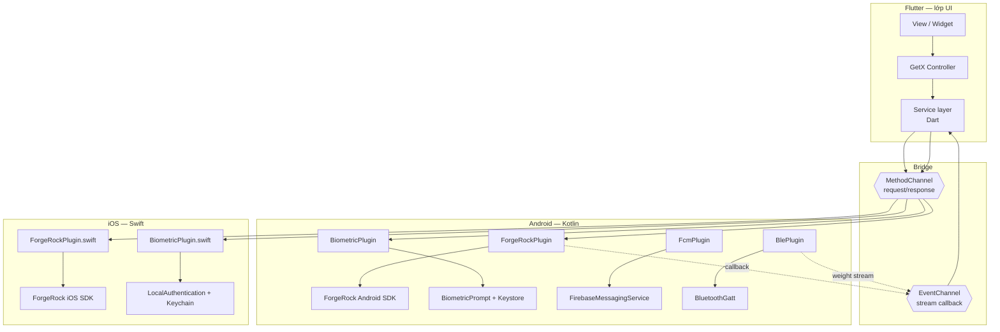

# 14 — Flutter bridge & GetX: kể sao cho ăn điểm khi ứng tuyển Native

> Nền tảng: [../07-tich-hop/native-bridge.md](../07-tich-hop/native-bridge.md).

Đây là trang **chiến thuật phỏng vấn**. Nền của bạn là Flutter, vị trí là Native Android. Trang này
giúp bạn biến điều đó từ điểm yếu thành điểm mạnh.

---

## 1. Vì sao phải bridge — câu trả lời chuẩn

Câu hỏi sẽ tới dưới dạng: *"Sao không làm hẳn Flutter cho nhanh?"* hoặc *"Em có thật sự viết
native không hay chỉ dùng plugin?"*

**Trả lời:**

> *"Có ba loại việc Flutter không làm thay được, và cả ba đều rơi đúng vào phần bảo mật:
>
> 1. **ForgeRock không phát hành SDK Flutter.** Chỉ có SDK Android (Java/Kotlin) và iOS (Swift).
>    Muốn dùng thì bắt buộc phải viết tầng native.
> 2. **Keystore, `CryptoObject`, WebAuthn** là API của hệ điều hành. Package `local_auth` của
>    Flutter chỉ trả về boolean — không đủ cho ngân hàng, vì boolean có thể bị hook.
> 3. **Vòng đời và quyền.** `FLAG_SECURE`, `ProcessLifecycleOwner`, runtime permission, FCM
>    service — đều phải viết ở tầng Android.
>
> Nên thực tế em viết khoảng 60% khối lượng công việc bằng Kotlin/Swift, Flutter chỉ là lớp UI."*

---

## 2. Ba cách bridge

| | `MethodChannel` | `EventChannel` | **Pigeon** |
|---|---|---|---|
| Mô hình | Request/response một lần | Stream từ native → Dart | Sinh code từ file định nghĩa |
| An toàn kiểu | ❌ `Map<String, Any?>`, sai key thì lỗi lúc chạy | ❌ | ✅ **Kiểm tra lúc biên dịch** |
| Hợp cho | `login()`, `getToken()`, `logout()` | Callback ForgeRock, BLE, sự kiện realtime | Toàn bộ, khi API đã ổn định |
| Nhược | Gõ sai tên method là lỗi runtime | Chỉ một chiều | Phải chạy generator mỗi lần đổi |

```dart
// Dart — phía Flutter
class ForgeRockService {
  static const _method = MethodChannel('eatsy/forgerock');
  static const _events = EventChannel('eatsy/forgerock/callbacks');

  Stream<FrNode> get nodes => _events
      .receiveBroadcastStream()
      .map((e) => FrNode.fromJson(jsonDecode(e as String)));

  Future<void> startLogin(String journey) =>
      _method.invokeMethod('startLogin', {'journey': journey});

  Future<String> getAccessToken() async {
    try {
      return await _method.invokeMethod<String>('getAccessToken') ?? '';
    } on PlatformException catch (e) {
      // ⚠️ Lỗi native tới Dart dưới dạng PlatformException — PHẢI map sang lỗi nghiệp vụ,
      // không được để lộ message kỹ thuật cho người dùng.
      throw AuthException.fromCode(e.code);
    }
  }
}
```

**Nếu làm lại từ đầu, dùng Pigeon.** Nói được điều này thể hiện bạn có nhìn lại và đánh giá quyết
định cũ:

> *"MethodChannel dùng `Map` không có kiểu. Đổi tên một key phía Kotlin mà quên sửa phía Dart thì
> không có lỗi biên dịch nào — chỉ phát hiện khi chạy tới đúng luồng đó, mà luồng MFA thì hiếm khi
> test tay. Nếu làm lại em sẽ dùng Pigeon để trình biên dịch bắt lỗi giúp."*

---

## 3. Bốn quy tắc bridge phải nhớ

### 3.1 Luôn trả kết quả trên main thread

```kotlin
// ❌ SAI — ForgeRock callback chạy trên background thread
override fun onSuccess(token: AccessToken) {
    result.success(token.value)   // crash: @UiThread must be executed on the main thread
}

// ✅ ĐÚNG
private val mainHandler = Handler(Looper.getMainLooper())
override fun onSuccess(token: AccessToken) {
    mainHandler.post { result.success(token.value) }
}
```

### 3.2 `MethodChannel.Result` chỉ được gọi **đúng một lần**

Gọi hai lần → `IllegalStateException: Reply already submitted`. Xảy ra khi SDK gọi cả `onSuccess`
lẫn `onError` (một số SDK làm thế), hoặc khi có timeout tự viết chạy đua với callback thật.

```kotlin
class SingleResult(private val delegate: MethodChannel.Result) : MethodChannel.Result {
    private val used = AtomicBoolean(false)
    override fun success(r: Any?) { if (used.compareAndSet(false, true)) delegate.success(r) }
    override fun error(c: String, m: String?, d: Any?) { if (used.compareAndSet(false, true)) delegate.error(c, m, d) }
    override fun notImplemented() { if (used.compareAndSet(false, true)) delegate.notImplemented() }
}
```

### 3.3 Không giữ `Activity` trong plugin

```kotlin
class ForgeRockPlugin : FlutterPlugin, ActivityAware {
    private var activity: Activity? = null    // nullable, KHÔNG phải lateinit

    override fun onAttachedToActivity(binding: ActivityPluginBinding) { activity = binding.activity }
    override fun onDetachedFromActivity() { activity = null }        // ⚠️ bắt buộc, nếu không rò rỉ
    override fun onDetachedFromActivityForConfigChanges() { activity = null }
    override fun onReattachedToActivityForConfigChanges(b: ActivityPluginBinding) { activity = b.activity }
}
```

`BiometricPrompt` cần `FragmentActivity`. Nếu người dùng xoay máy giữa lúc prompt đang hiện,
Activity cũ bị huỷ. Quên `onDetachedFromActivity` → giữ Activity chết → rò rỉ + crash khi hiện
prompt lên window đã mất.

### 3.4 Chi phí serialize là có thật

Mỗi lần qua channel là một lần **encode/decode**. Gửi list 1000 phần tử mỗi 100ms sẽ làm giật UI.
Với BLE của Eatsy, cân gửi ~10 gói/giây — phải **lọc và giảm tần suất ở phía native** (chỉ gửi khi
`isStable` và giá trị đổi) thay vì bơm hết sang Dart.

---

## 4. GetX ↔ MVVM Android: bảng chuyển đổi

| GetX | Android native | Ghi chú khi trả lời |
|---|---|---|
| `GetxController` | `ViewModel` | ViewModel **không được** import `android.view`/`Context` |
| `.obs` / `Rx<T>` | `StateFlow<T>` | Cả hai đều "giá trị hiện tại + phát thay đổi" |
| `Obx(() => ...)` | `collect` trong `repeatOnLifecycle(STARTED)` | Android phải nói rõ **lifecycle**, GetX giấu đi |
| `onInit()` | `init { }` | |
| `onClose()` | `onCleared()` | |
| `Get.put()` / `Get.find()` | `AppContainer` (repo này) hoặc Hilt | Cùng là service locator |
| `Get.toNamed('/x')` | `AppRouter.openX(activity)` | |
| `Get.snackbar(...)` trong controller | ❌ **Không làm thế** — phát `Channel` event, View hiển thị | Đây là khác biệt kiến trúc lớn nhất |
| `GetxService` (permanent) | Singleton trong `AppContainer` | |
| `Workers`: `ever`, `debounce` | `flow.debounce()`, `collectLatest` | Flow mạnh hơn nhiều |

### Ba khác biệt bạn nên chủ động nêu

**1. Ranh giới UI.** GetX cho controller gọi thẳng `Get.snackbar`, `Get.to`. Tiện nhưng làm
controller phụ thuộc UI → không test được bằng unit test thuần. Android tách cứng: ViewModel phát
state + event, View quyết định vẽ gì. Nhờ đó test ViewModel bằng JUnit không cần thiết bị.

**2. Huỷ tự động.** `viewModelScope` huỷ mọi coroutine khi ViewModel chết. GetX không có cơ chế
tương đương ở mức ngôn ngữ — quên `.cancel()` là rò rỉ. Đây là lý do Android ít bị lỗi
"cập nhật UI của màn đã đóng".

**3. Process death.** Flutter không có khái niệm này (Dart VM giữ toàn bộ state). Android bắt buộc
nghĩ tới `SavedStateHandle`. **Đây là điều quan trọng nhất bạn học được khi chuyển sang native**,
và là câu trả lời rất tốt cho *"Em thấy khác biệt lớn nhất là gì?"*

---

## 5. Kiến trúc thật của app bạn từng làm



**Cách mô tả trong phỏng vấn (90 giây):**

> *"App có ba tầng. Trên cùng là Flutter lo giao diện và điều hướng, dùng GetX cho state. Dưới cùng
> là hai tầng native — Kotlin và Swift — nơi em gọi ForgeRock SDK, Keystore/Keychain, biometric,
> FCM, BLE. Ở giữa là hai kênh: MethodChannel cho các lời gọi một lần như login hay lấy token, và
> EventChannel cho luồng nhiều bước như callback của Journey — vì app không biết trước cây xác thực
> có bao nhiêu node, server đẩy về đến đâu thì app render đến đó. Phần khó nhất không phải Flutter,
> mà là đảm bảo hai tầng native hành xử giống nhau khi Android và iOS có mô hình bảo mật khác nhau."*

---

## 6. Điểm mạnh cần nhấn khi ứng tuyển Native

| Người phỏng vấn lo | Bạn chứng minh bằng |
|---|---|
| "Không biết vòng đời Android" | Kể `onDetachedFromActivity`, `ProcessLifecycleOwner`, process death, xoay máy giữa lúc BiometricPrompt đang hiện |
| "Chỉ biết gọi plugin có sẵn" | Bạn **viết** plugin, không dùng plugin. Kể `local_auth` không đủ nên phải tự viết `CryptoObject` |
| "Không biết XML layout" | Repo `NativeKotlin` này: ViewBinding, layout variants theo `-w936dp`, Material 3 theming, `styles.xml` |
| "Không quen kiến trúc native" | MVVM + StateFlow + Channel + Repository, và giải thích được **vì sao** khác GetX |
| "Không biết build/release Android" | 3 flavor, `signingConfigs`, Play App Signing, staged rollout |

> **Câu tổng kết cho phần này:** *"Em không đến từ Flutter, em đến từ tầng native của một app
> Flutter. Phần em làm là phần Flutter không làm được."*

---

## 7. Nếu bị hỏi so sánh Flutter vs Native

Đừng chê Flutter — công ty có thể đang cân nhắc dùng nó.

| Tiêu chí | Flutter | Native |
|---|---|---|
| Tốc độ phát triển 2 nền tảng | ✅ Nhanh hơn nhiều | Gấp đôi công |
| Hiệu năng UI | Rất tốt (Impeller), nhưng khởi động chậm hơn | ✅ Tốt nhất |
| Kích thước app | +5–10MB | ✅ Nhỏ hơn |
| SDK bảo mật của bên thứ ba | ❌ Thường không có bản Flutter | ✅ Luôn có |
| Tính năng hệ điều hành mới | Chờ plugin | ✅ Có ngay |
| Widget / màn hình khoá / tích hợp sâu | ❌ Yếu | ✅ |
| Tuyển người | Khó hơn ở VN | ✅ Dễ hơn |

**Kết luận nên nói:** *"Với app ngân hàng, em nghiêng về native — vì phần lớn rủi ro nằm ở tích
hợp SDK bảo mật và API hệ điều hành, đúng chỗ Flutter yếu nhất. Flutter rất hợp cho app nội dung
hoặc thương mại điện tử cần ra hai nền tảng nhanh."*

---

## Từ khoá phải thuộc

`MethodChannel` · `EventChannel` · `BasicMessageChannel` · `Pigeon` · `PlatformException` ·
`FlutterPlugin` / `ActivityAware` · `onDetachedFromActivity` · `Reply already submitted` ·
`Handler(Looper.getMainLooper())` · `@UiThread` · `GetxController` ↔ `ViewModel` ·
`.obs` ↔ `StateFlow` · `Obx` ↔ `repeatOnLifecycle` · `Get.put` ↔ service locator ·
`viewModelScope` · `SavedStateHandle` / process death
