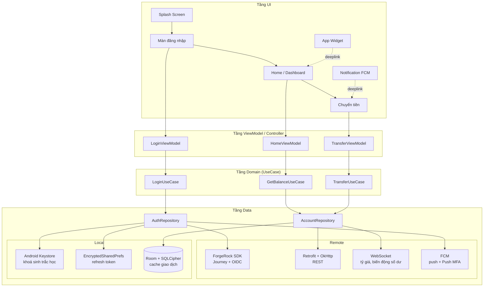
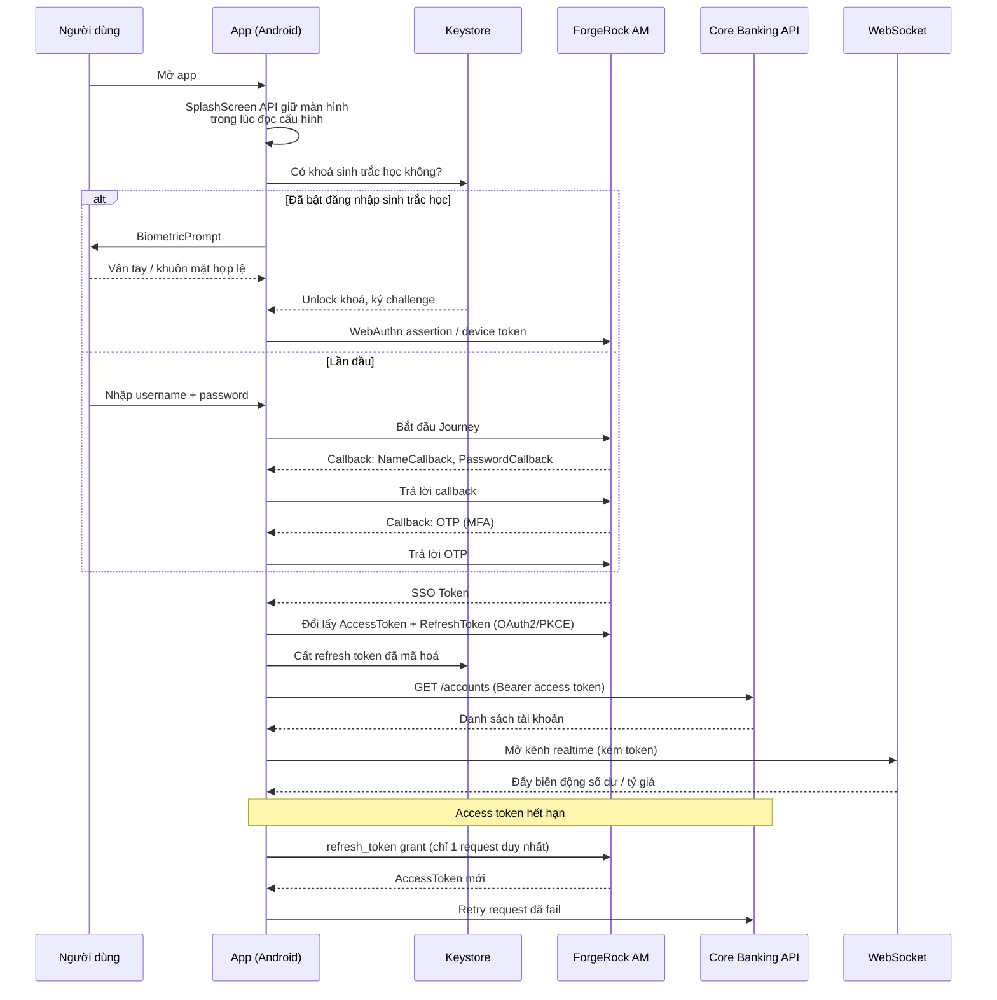

# 08 — Ôn tập phỏng vấn: Mobile Banking Native (Android)

> **Mục này khác các mục 01–07.** Mục 01–07 mô tả *repo này*. Mục 08 là **tài liệu ôn phỏng vấn**,
> viết bám vào **kinh nghiệm thật của bạn** (Flutter + GetX, ForgeRock Android/iOS SDK qua
> MethodChannel, WebAuthn/passkey, FCM, 3 flavor, Makefile, app Eatsy + cân Bluetooth) và ánh xạ
> sang **JD Mobile Banking Native**. Code trong mục này là code minh hoạ để luyện tay, **không phải
> code đang chạy trong repo**.

Vị trí bạn ứng tuyển là **Native Android**, nhưng nền của bạn là **Flutter bridge sang native**.
Đó không phải điểm yếu nếu bạn kể đúng: bạn đã phải viết **cả tầng native Android (Kotlin/Java)**
để bridge ForgeRock SDK, tức là bạn đã làm đúng phần khó nhất của native — SDK bảo mật, Keystore,
biometric, lifecycle. Chiến lược trả lời: **luôn kéo câu chuyện về phía native**, Flutter chỉ là
lớp UI phía trên.

---

## 1. Bản đồ JD → tài liệu

| Gạch đầu dòng trong JD | Đọc trang nào | Mức ưu tiên |
|---|---|---|
| Tích hợp RESTful API, WebSocket | [05 — API & bảo mật](05-api-bao-mat.md), [04 — WebSocket](04-websocket.md) | 🔴 Cao nhất |
| Ứng dụng Mobile Banking, an toàn | [01 — IAM/ForgeRock](01-iam-forgerock.md), [02 — Biometric/WebAuthn](02-biometric-webauthn.md), [05 §6 bảo mật](05-api-bao-mat.md) | 🔴 Cao nhất |
| MVC/MVP/MVVM/Clean Architecture | [../01-kien-truc/](../01-kien-truc/mvvm.md) + [07 — Router & State](07-router-state.md) | 🔴 Cao nhất |
| Java/Kotlin, Android SDK, OOP | [12 — Key concepts](12-key-concepts.md), [../06-kotlin/](../06-kotlin/kotlin-android.md) | 🟠 Cao |
| Debug, xử lý lỗi, tối ưu hiệu năng | [11 — Khó khăn thực tế](11-kho-khan-thuc-te.md), [12 §5 hiệu năng](12-key-concepts.md) | 🟠 Cao |
| Nguyên tắc UI/UX mobile | [09 — Modal/BottomSheet/Popup](09-modal-popup.md), [08 — Splash & Widget](08-splash-widget.md) | 🟡 Vừa |
| Git, làm việc nhóm, Agile/Scrum | [10 — Flavor & Makefile](10-flavor-makefile.md) §5 | 🟡 Vừa |
| Postman, Swagger | [05 §8](05-api-bao-mat.md) | 🟡 Vừa |
| Hỗ trợ SIT/UAT/Production | [10 — Flavor & Makefile](10-flavor-makefile.md), [11 §7 hotfix](11-kho-khan-thuc-te.md) | 🟠 Cao |
| Dịch vụ liên quan (push, realtime) | [03 — FCM & Push](03-fcm-push.md) | 🟠 Cao |

---

## 2. Mục lục

| # | Trang | Nội dung cốt lõi |
|---|---|---|
| 01 | [IAM & ForgeRock](01-iam-forgerock.md) | IAM vs IAA vs IGA, OAuth2/OIDC/PKCE, Journey & Callback, vòng đời token, SSO, bridge sang Flutter |
| 02 | [Biometric & WebAuthn/Passkey](02-biometric-webauthn.md) | `BiometricPrompt` + `CryptoObject`, Keystore invalidation, FIDO2/passkey, device binding |
| 03 | [FCM & Push](03-fcm-push.md) | Vòng đời token, data vs notification, Push MFA, Doze, deeplink từ notification |
| 04 | [WebSocket & realtime](04-websocket.md) | OkHttp WebSocket/STOMP, reconnect backoff, heartbeat, gắn lifecycle, auth |
| 05 | [API & bảo mật](05-api-bao-mat.md) | Retrofit, refresh token single-flight, certificate pinning, root detection, ký request |
| 06 | [SQLite & lưu trữ](06-sqlite-luu-tru.md) | Room, migration, SQLCipher, Keystore, EncryptedSharedPreferences, offline-first |
| 07 | [AppRouter & quản lý state](07-router-state.md) | Router thủ công, deeplink, process death, StateFlow vs LiveData vs GetX |
| 08 | [Splash Screen & Widget](08-splash-widget.md) | SplashScreen API 12+, chống splash 2 lần, AppWidget + RemoteViews |
| 09 | [Modal · BottomSheet · Popup](09-modal-popup.md) | Bottom/top/left/right sheet, dialog, các bẫy về lifecycle và accessibility |
| 10 | [Flavor & Makefile automation](10-flavor-makefile.md) | 3 flavor Android + Xcode scheme/Podfile/Info.plist, Makefile, CI, quy trình SIT/UAT |
| 11 | [Khó khăn thực tế (STAR)](11-kho-khan-thuc-te.md) | 10 câu chuyện kể được trong phỏng vấn: ForgeRock, Google Sign-In, Face ID, BLE |
| 12 | [Key concepts & câu hỏi phỏng vấn](12-key-concepts.md) | Từ khoá bắt buộc thuộc + ngân hàng câu hỏi có đáp án |
| — | [Bluetooth — cân điện tử (Eatsy)](13-bluetooth-eatsy.md) | BLE GATT, quyền, parse dữ liệu cân, reconnect |
| — | [Flutter bridge & GetX](14-flutter-bridge-getx.md) | MethodChannel/EventChannel/Pigeon, GetX so với MVVM native |

---

## 3. Luồng tổng quan — mọi thứ nối với nhau thế nào

Đây là sơ đồ bạn nên **vẽ lại được trên giấy trong 3 phút**. Nhiều buổi phỏng vấn banking bắt đầu
bằng đúng câu: *"Em mô tả kiến trúc app em từng làm."*

**Bốn điều người phỏng vấn muốn nghe từ sơ đồ này:**

1. **Token không bao giờ nằm trong `SharedPreferences` thường** — refresh token vào
   `EncryptedSharedPreferences`, khoá bọc trong Android Keystore, access token giữ trong RAM.
2. **Repository là ranh giới duy nhất** giữa domain và mạng/DB. ViewModel không biết Retrofit tồn tại.
3. **WebSocket và FCM là hai kênh khác nhau, không thay thế nhau.** WebSocket = realtime khi app
   đang mở. FCM = đánh thức app khi đã đóng. Banking cần cả hai.
4. **Mọi đường vào app (widget, notification, deeplink) đều phải đi qua kiểm tra phiên**, không được
   nhảy thẳng vào màn chuyển tiền.

---

## 4. Luồng "một phiên ngân hàng" từ đầu tới cuối

---

## 5. Lộ trình ôn 7 ngày

| Ngày | Đọc | Luyện tay |
|---|---|---|
| 1 | 01 + 02 | Vẽ lại luồng OAuth2/PKCE và luồng biometric-bind-key trên giấy, không nhìn tài liệu |
| 2 | 05 + 04 | Viết `AuthInterceptor` + `Authenticator` refresh token single-flight từ đầu |
| 3 | 03 + 06 | Viết `FirebaseMessagingService` xử lý cả 2 loại message; viết 1 migration Room |
| 4 | 07 + 09 | Viết lại `AppRouter` của repo này, thêm deeplink; làm 1 BottomSheetDialogFragment có state |
| 5 | 08 + 10 + 13 + 14 | Dựng 3 flavor trong repo này, chạy `assembleSitDebug`; đọc lại code BLE Eatsy |
| 6 | 11 | Viết ra giấy 10 câu chuyện STAR, mỗi câu 90 giây |
| 7 | 12 | Tự trả lời to thành tiếng toàn bộ ngân hàng câu hỏi |

---

## 6. Ba câu hỏi bạn gần như chắc chắn bị hỏi

1. **"Token em lưu ở đâu, tại sao?"** → [01 §5](01-iam-forgerock.md) + [06 §4](06-sqlite-luu-tru.md).
   Trả lời sai câu này là hỏng buổi phỏng vấn banking.
2. **"Access token hết hạn giữa lúc 5 API đang chạy song song thì sao?"** →
   [05 §3](05-api-bao-mat.md). Từ khoá phải bật ra: **single-flight refresh**, `Authenticator`, mutex.
3. **"Sao em không dùng Flutter luôn mà phải bridge sang native?"** →
   [14 §1](14-flutter-bridge-getx.md). Đáp án: ForgeRock **không có** SDK Flutter chính thức, và các
   thao tác Keystore/biometric/attestation bắt buộc chạy native.
